# ozyab09_microservices
ozyab09 microservices repository


### Homework 23 (kubernetes-3)
[](https://travis-ci.com/Otus-DevOps-2018-09/ozyab09_microservices)

Service - абстракции, определяющей конечные узлы доступа (Endpoint’ы) и способ коммуникации с ними (nodePort, LoadBalancer, ClusterIP).

Service - определяет конечные узлы доступа (Endpoint’ы):
- селекторные сервисы (k8s сам находит POD-ы по label’ам)
- безселекторные сервисы (мы вручную описываем конкретные endpoint’ы) 

и способ коммуникации с ними (тип (type) сервиса):
- ClusterIP - дойти до сервиса можно только изнутри кластера
- nodePort - клиент снаружи кластера приходит на опубликованный порт
- LoadBalancer - клиент приходит на облачный (aws elb, Google gclb) ресурс балансировки
- ExternalName - внешний ресурс по отношению к кластеру

Ранее был описан service:
```yml
post-service.yml

---
apiVersion: v1
kind: Service
metadata:
  name: post
  labels:
    app: reddit
    component: post
spec:
  ports:
  - port: 5000
    protocol: TCP
    targetPort: 5000
  selector:
    app: reddit
    component: post
```
Это селекторный сервис типа ClusetrIP (тип не указан, т.к. этот тип по-умолчанию).

ClusterIP - это виртуальный (в реальности нет интерфейса, pod’а или машины с таким адресом) IP-адрес из диапазона адресов для работы внутри, скрывающий за собой IP-адреса реальных POD-ов. Сервису любого типа (кроме ExternalName) назначается этот IP-адрес.

```
$ kubectl get services -n dev
```
> output
```
NAME         TYPE        CLUSTER-IP      EXTERNAL-IP   PORT(S)          AGE
comment      ClusterIP   10.11.248.46    <none>        9292/TCP         2d
comment-db   ClusterIP   10.11.252.202   <none>        27017/TCP        2d
mongo        ClusterIP   10.11.243.229   <none>        27017/TCP        2d
post         ClusterIP   10.11.254.105   <none>        5000/TCP         2d
post-db      ClusterIP   10.11.240.87    <none>        27017/TCP        2d
ui           NodePort    10.11.245.7     <none>        9292:32092/TCP   2d
```
Схема взаимодействия:
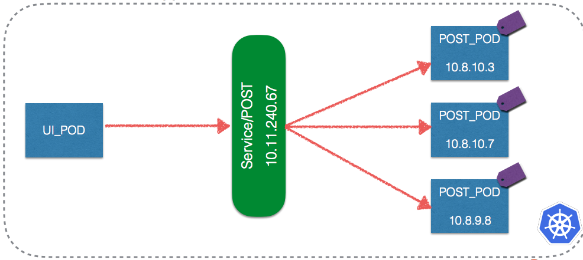

Service - это лишь абстракция и описание того, как получить доступ к сервису. Но опирается она на реальные механизмы и объекты: DNS-сервер, балансировщики, iptables.

Для того, чтобы дойти до сервиса, нам нужно узнать его адрес по имени. Kubernetes не имеет своего собственного DNS-сервера для разрешения имен. Поэтому используется плагин kube-dns (это тоже Pod).

Его задачи:
- ходить в API Kubernetes’a и отслеживать Service-объекты
- заносить DNS-записи о Service’ах в собственную базу
- предоставлять DNS-сервис для разрешения имен в IP-адреса (как внутренних, так и внешних)


При отключенном kube-dns сервисе связность между компонентами reddit-app пропадет и он перестанет работать.

Проскейлим в 0 сервис, который следит, чтобы dns-kube подов всегда хватало. Аналогично поступим с kube-dns:
```
$ kubectl scale deployment --replicas 0 -n kube-system kube-dns-autoscaler
$ kubectl scale deployment --replicas 0 -n kube-system kube-dns
```
Выполним команду:
```
kubectl exec -ti -n dev post-8ff9c4cb9-h4zpq ping comment
```
> output:
```
ping: bad address 'comment'
command terminated with exit code 1
```
Вернем автоскеллер:
```
kubectl scale deployment --replicas 1 -n kube-system kube-dns-autoscaler
```

ClusterIP - виртуальный и не принадлежит ни одной реальной физической сущности. Его чтением и дальнейшими действиями с пакетами, принадлежащими ему, занимается в нашем случае iptables, который настраивается утилитой kube-proxy (забирающей инфу с API-сервера).

Сам kube-proxy, можно настроить на прием трафика, но это устаревшее поведение и не рекомендуется его применять.

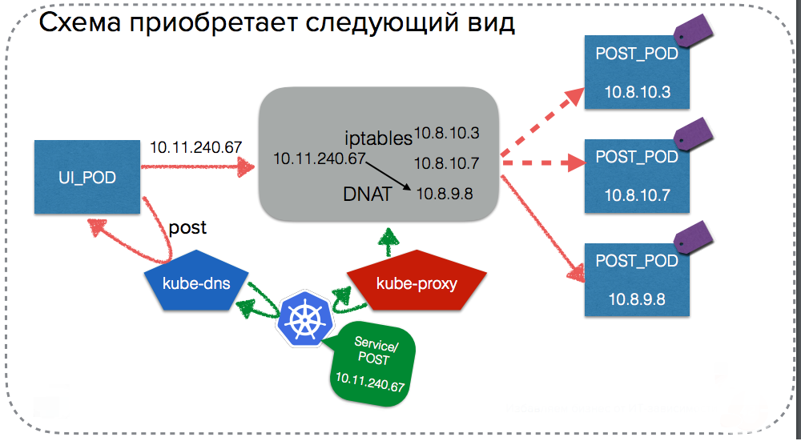

Независимо от того, на одной ноде находятся поды или на разных - трафик проходит через цепочку, изображенную выше.
Kubernetes не имеет в комплекте механизма организации overlay сетей (как у Docker Swarm). Он лишь предоставляет интерфейс для этого. Для создания Overlay-сетей используются отдельные аддоны: Weave, Calico, Flannel, … . 

В Google Kontainer Engine (GKE) используется собственный плагин kubenet (он - часть kubelet). Он работает только вместе с платформой GCP и, по-сути занимается тем, что настраивает google-сети для передачи трафика Kubernetes. Поэтому в конфигурации Docker сейчас вы не увидите никаких Overlay-сетей.

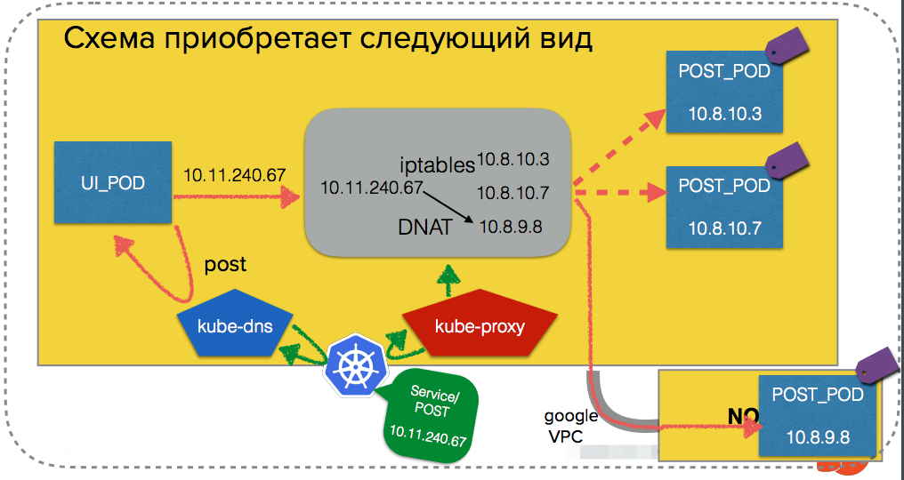

* NodePort - похож на сервис типа ClusterIP, только к нему прибавляется прослушивание портов нод (всех нод) для доступа к сервисам снаружи.
При этом ClusterIP также назначается этому сервису для доступа к нему изнутри кластера. kube-proxy прослушивается либо заданный порт (nodePort: 32092), либо порт из диапазона 30000-32670. Дальше IPTables решает, на какой Pod попадет трафик.

Сервис UI раньше уже был опубликован наружу с помощью NodePort:
```yml
ui-service.yml

---
apiVersion: v1
kind: Service
metadata:
  name: ui
  labels:
    app: reddit
    component: ui
spec:
  type: NodePort
  ports:
  - port: 9292
    nodePort: 32092
    protocol: TCP
    targetPort: 9292
  selector:
    app: reddit
    component: ui
```

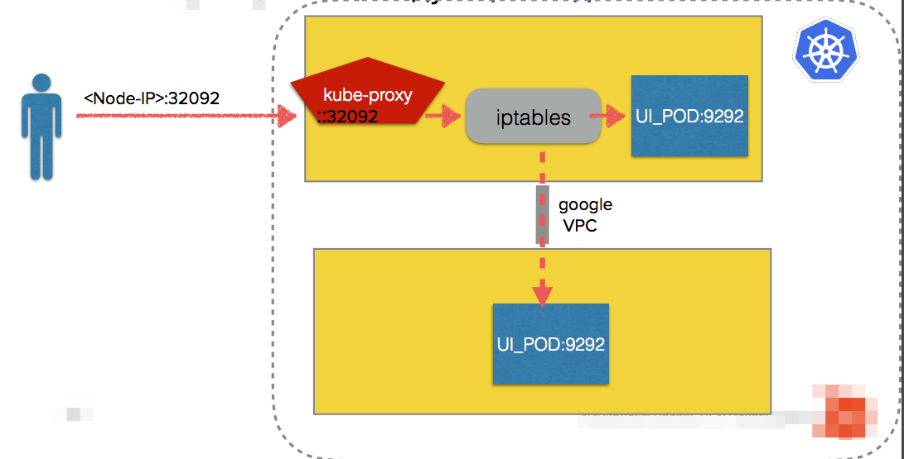

* LoadBalancer

NodePort хоть и предоставляет доступ к сервису снаружи, но открывать все порты наружу или искать IPадреса наших нод (которые вообще динамические) не очень удобно. 

Тип LoadBalancer позволяет нам использовать внешний облачный балансировщик нагрузки как единую точку входа в наши сервисы, а не полагаться на IPTables и не открывать наружу весь кластер.

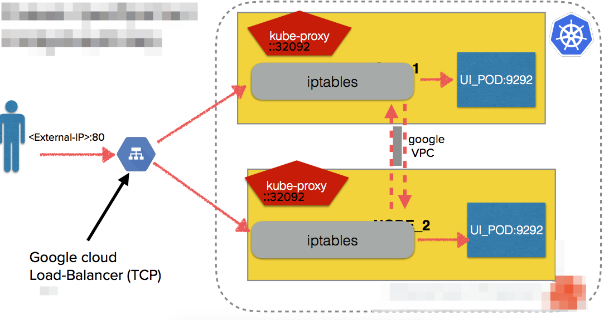

Настроим соответствующим образом Service UI:
```yml
ui-service.yml 

---
apiVersion: v1
kind: Service
metadata:
  name: ui
  labels:
    app: reddit
    component: ui
spec:
  type: LoadBalancer
  ports:
  - port: 80  # Порт, который будет открыт на балансировщике
    nodePort: 32092 #Также на ноде будет открыт порт, но нам он не нужен и его можно даже убрать
    protocol: TCP
    targetPort: 9292 #Порт POD-а
  selector:
    app: reddit
    component: ui
```

Применим изменения: `$ kubectl apply -f ui-service.yml -n dev`

Проверим: `$ kubectl get service -n dev --selector component=ui`

> output

```
NAME   TYPE           CLUSTER-IP    EXTERNAL-IP      PORT(S)        AGE
ui     LoadBalancer   10.11.245.7   35.222.133.XXX   80:32092/TCP   2d
```

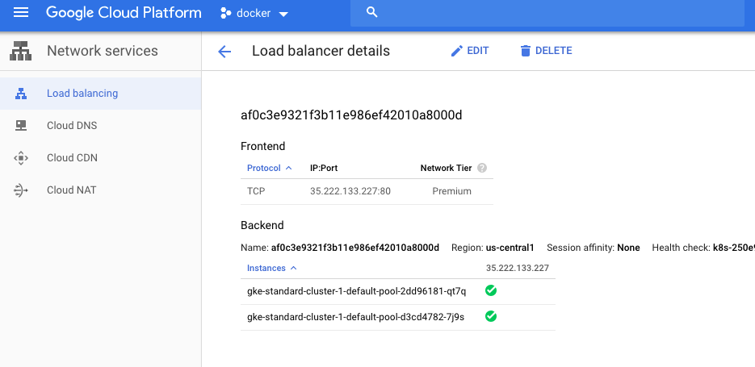


Балансировка с помощью Service типа LoadBalancing имеет ряд недостатков:
- нельзя управлять с помощью http URI (L7-балансировка)
- используются только облачные балансировщики (AWS, GCP)
- нет гибких правил работы с трафиком

* Ingress

Для более удобного управления входящим снаружи трафиком и решения недостатков LoadBalancer можно использовать другой объект Kubernetes - Ingress. 

Ingress – это набор правил внутри кластера Kubernetes, предназначенных для того, чтобы входящие подключения могли достичь сервисов (Services).

Сами по себе Ingress’ы это просто правила. Для их применения нужен Ingress Controller.

* Ingress Conroller

В отличие остальных контроллеров k8s - он не стартует вместе с кластером.

Ingress Controller - это скорее плагин (а значит и отдельный POD), который состоит из 2-х функциональных частей:
- Приложение, которое отслеживает через k8s API новые объекты Ingress и обновляет конфигурацию балансировщика
- Балансировщик (Nginx, haproxy, traefik,…), который и занимается управлением сетевым трафиком

Основные задачи, решаемые с помощью Ingress’ов:
- Организация единой точки входа в приложения снаружи
- Обеспечение балансировки трафика
- Терминация SSL
- Виртуальный хостинг на основе имен и т.д

Посколько у нас web-приложение, нам вполне было бы логично использовать L7-балансировщик вместо Service LoadBalancer.

Google в GKE уже предоставляет возможность использовать их собственные решения балансирощик в качестве Ingress controller-ов. 

Убедимся, что встроенный Ingress включен:
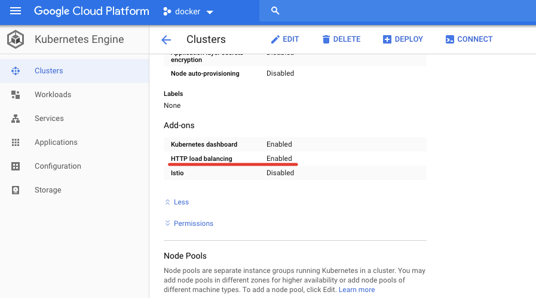

Создадим Ingress для сервиса UI:
```yml
ui-ingress.yml

---
apiVersion: extensions/v1beta1
kind: Ingress
metadata:
  name: ui
spec:
  backend:
    serviceName: ui
    servicePort: 80
```
Это Singe Service Ingress - значит, что весь ingress контроллер будет просто балансировать нагрузку на Node-ы для одного сервиса (очень похоже на Service LoadBalancer).

```
$ kubectl apply -f ui-ingress.yml -n dev
```
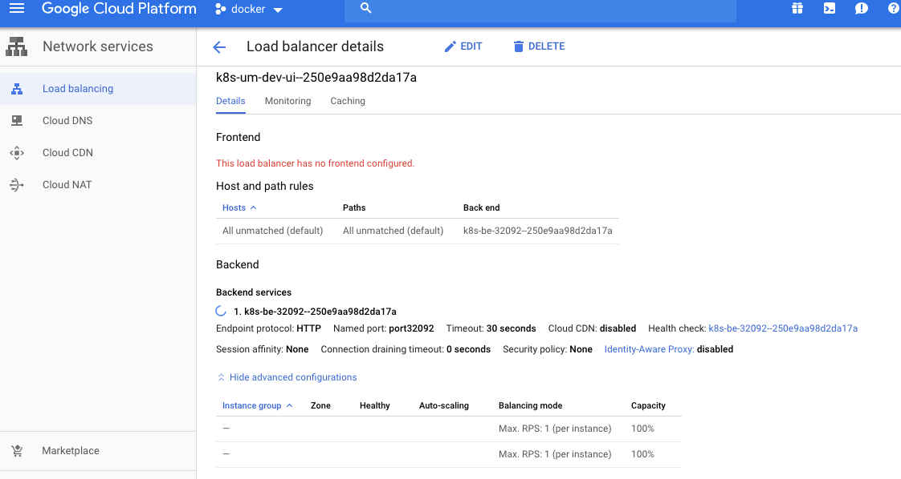

Посмотрим в кластер: `kubectl get ingress -n dev`

> output
```
NAME   HOSTS   ADDRESS         PORTS   AGE
ui     *       35.201.126.XXX   80      2m
```

Теперь схема выглядит так:

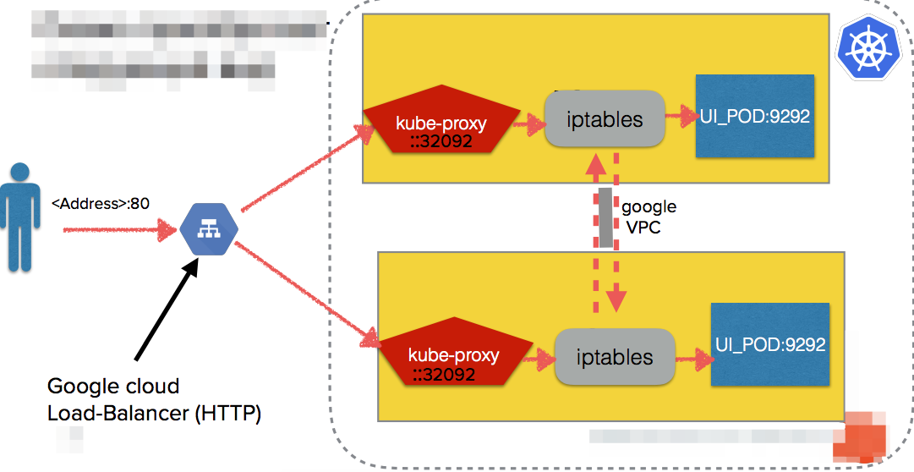


В текущей схеме есть несколько недостатков:
- у нас 2 балансировщика для 1 сервиса
- Мы не умеем управлять трафиком на уровне HTTP 

Один из балансирощиков можно убрать. Обновим сервис UI:

```yml
ui-service.yml

---
apiVersion: v1
kind: Service
metadata:
  ...
spec:
  type: NodePort #заменим на NodePort
  ports:
  - port: 9292
    protocol: TCP
    targetPort: 9292
  selector:
    app: reddit
    component: ui
```

`$ kubectl apply -f … -n dev` для применения настроек.

Заставим работать Ingress Controller как классический веб:

```yml
ui-ingress.yml

---
apiVersion: extensions/v1beta1
kind: Ingress
metadata:
  name: ui
spec:
  rules:
  - http:
      paths:
      - path: /*
        backend:
          serviceName: ui
          servicePort: 9292
```

`$ kubectl apply -f ui-ingress.yml -n dev` для применения

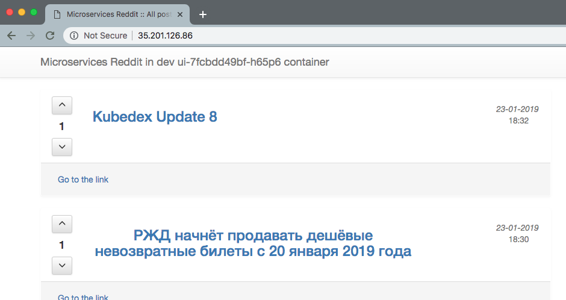

* Secret

Защитим наш сервис с помощью TLS. Найдем наш IP: `$ kubectl get ingress -n dev`
> output
```
NAME   HOSTS   ADDRESS         PORTS   AGE
ui     *       35.201.126.86   80      1d
```

Подготовим сертификат используя IP как CN:
```
$ openssl req -x509 -nodes -days 365 -newkey rsa:2048 -keyout tls.key -out tls.crt -subj "/CN=35.201.126.86"
```

Загрузка сертификата в кластер:
```
$ kubectl create secret tls ui-ingress --key tls.key --cert tls.crt -n dev
```

Проверка наличия сертификата:
```
$ kubectl describe secret ui-ingress -n dev
```
> output
```
Name:         ui-ingress
Namespace:    dev
Labels:       <none>
Annotations:  <none>

Type:  kubernetes.io/tls

Data
====
tls.crt:  989 bytes
tls.key:  1704 bytes
```

Настроим Ingress на прием только HTTPS трафика:
```yml
ui-ingress.yml

---
apiVersion: extensions/v1beta1
kind: Ingress
metadata:
  name: ui
  annotations:
    kubernetes.io/ingress.allow-http: "false" #отключаем проброс http
spec:
  tls:
  - secretName: ui-ingress #подключаем сертификат
  backend:
    serviceName: ui
    servicePort: 9292
```

`$ kubectl apply -f ui-ingress.yml -n dev` для применения.

Перейдем на страницу load-balancer'а:


Видим, что у нас все еще http load balacer. Вручную удалим и создадим load balancer:
```
$ kubectl delete ingress ui -n dev
$ kubectl apply -f ui-ingress.yml -n dev
```

* Network Policy

Ранее мы приняли следующую схему сетей сервисов:

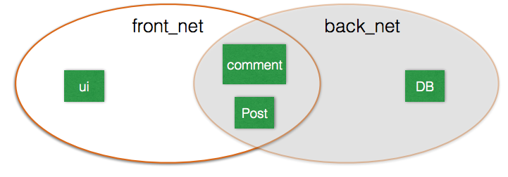

В Kubernetes у нас так сделать не получится с помощью отдельных сетей, так как все POD-ы могут достучаться друг до друга по-умолчанию.

NetworkPolicy - инструмент для декларативного описания потоков трафика. Не все сетевые плагины поддерживают политики сети. В частности, у GKE эта функция пока в Beta-тесте и для её работы отдельно будет включен сетевой плагин Calico (вместо Kubenet).

Давайте ее протеструем. Наша задача - ограничить трафик, поступающий на mongodb отовсюду, кроме сервисов post и comment.

Найдем имя кластера:
```
$ gcloud beta container clusters list
```
> output

```
NAME                LOCATION       MASTER_VERSION  MASTER_IP     MACHINE_TYPE  NODE_VERSION    NUM_NODES  STATUS
standard-cluster-1  us-central1-a  1.10.11-gke.1   35.202.73.52  g1-small      1.10.9-gke.5 *  2          RUNNING
```

Включим network-policy для GKE:
```
gcloud beta container clusters update standard-cluster-1 --zone=us-central1-a --update-addons=NetworkPolicy=ENABLED
gcloud beta container clusters update standard-cluster-1 --zone=us-central1-a  --enable-network-policy
```

Создадим network policy для mongo:
```yml
mongo-network-policy.yml

---
apiVersion: networking.k8s.io/v1
kind: NetworkPolicy
metadata:
  name: deny-db-traffic
  labels:
    app: reddit
spec:
  podSelector:    # выбираем объекты политики (POD'ы с mongodb)
    matchLabels:
      app: reddit
      component: mongo
  policyTypes:    # блок запрещающих направлений: Запрещаем все входящие подключения
  - Ingress       # Исходящие разрешены
  ingress:        # блок разрешающих направлений
  - from:         # (белый список)
    - podSelector:    
        matchLabels:
          app: reddit         # Разрешаем все входящие подключения от
          component: comment  # POD-ов с label-ами comment
```

Применяем политику: `$ kubectl apply -f mongo-network-policy.yml -n dev`

Для доступа post-сервиса в базу данных добавим:
```
mongo-network-policy.yml
...
- podSelector:
  matchLabels:
    app: reddit
    component: post
```

* Хранилище для баз данных

Основной Stateful сервис в нашем приложении - это база данных MongoDB. В текущий момент она запускается в виде Deployment и хранит данные в стаднартный Docker Volume-ах. Это имеет несколько проблем:
- при удалении POD-а удаляется и Volume
- потеря Nod’ы с mongo грозит потерей данных
- запуск базы на другой ноде запускает новый экземпляр данных

```yml
mongo-deployment.yml

---
apiVersion: apps/v1beta1
kind: Deployment
metadata:
  name: mongo
...
    spec:
      containers:
      - image: mongo:3.2
        name: mongo
        volumeMounts:   # подключаем Volume
        - name: mongo-persistent-storage
          mountPath: /data/db
      volumes:
      - name: mongo-persistent-storage # объявляем Volume
        emptyDir: {}
```

Сейчас используется тип Volume emptyDir. При создании пода с таким типом просто создается пустой docker volume. При остановке POD’a содержимое emtpyDir удалится навсегда. Хотя в общем случае падение POD’a не вызывает удаления Volume’a.
Вместо того, чтобы хранить данные локально на ноде, имеет смысл подключить удаленное  хранилище. В нашем случае можем использовать Volume gcePersistentDisk, который будет складывать данные в хранилище GCE.

Создадим диск в Google Cloud:
```
$ gcloud compute disks create --size=25GB --zone=us-central1-a reddit-mongo-disk
```

Добавим новый Volume POD-у базы:

```yml
mongo-deployment.yml

---
apiVersion: apps/v1beta1
kind: Deployment
    ...
    spec:
      containers:
      - image: mongo:3.2
        name: mongo
        volumeMounts:
        - name: mongo-gce-pd-storage
          mountPath: /data/db
      volumes:
      - name: mongo-persistent-storage
        emptyDir: {}
        volumes:
      - name: mongo-gce-pd-storage
        gcePersistentDisk:
          pdName: reddit-mongo-disk # меняем Volume на другой тип
          fsType: ext4
```

Монтируем выделенный диск к POD'у mongo:

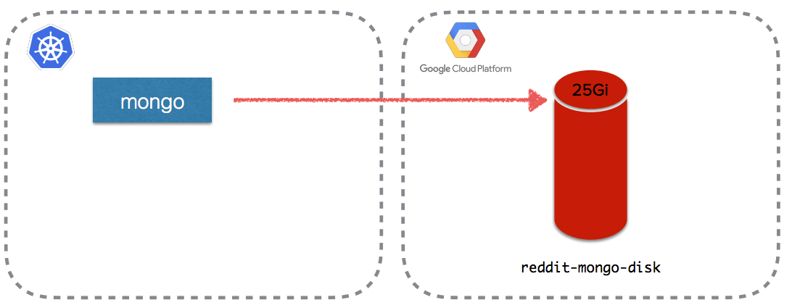

```
kubectl apply -f mongo-deployment.yml -n dev
```

Дождемся пересоздания POD'a (может занять до 10 минут).

Создадим пост:

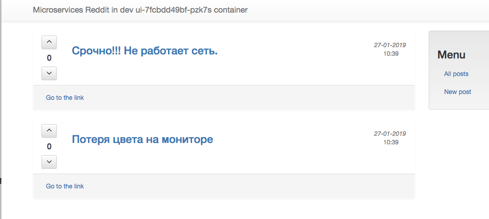

Пересоздадим mongo-deployment:

```
$ kubectl delete deploy mongo -n dev
$ kubectl apply -f mongo-deployment.yml -n dev
```

Посты останутся на месте.

* PersistentVolume

Используемый механизм Volume-ов можно сделать удобнее. Мы можем использовать не целый выделенный диск для каждого пода, а целый ресурс хранилища, общий для всего кластера. Тогда при запуске Stateful-задач в кластере, мы сможем запросить хранилище в виде такого же ресурса, как CPU или оперативная память. Для этого будем использовать механизм PersistentVolume.

Описание PersistentVolume:

```yml
mongo-volume.yml

---
apiVersion: v1
kind: PersistentVolume
metadata:
  name: reddit-mongo-disk # Имя PersistentVolume'а
spec:
  capacity:
    storage: 25Gi
  accessModes:
    - ReadWriteOnce
  persistentVolumeReclaimPolicy: Retain
  gcePersistentDisk:
    fsType: "ext4" 
    pdName: "reddit-mongo-disk" # Имя диска в GCE
```

Добавим PersistentVolume в кластер: `$ kubectl apply -f mongo-volume.yml -n dev`


Мы создали PersistentVolume в виде диска в GCP:


* PersistentVolumeClaim

Мы создали ресурс дискового хранилища, распространенный на весь кластер, в виде PersistentVolume. Чтобы выделить приложению часть такого ресурса - нужно создать запрос на выдачу - PersistentVolumeClaim. Claim - это именно запрос, а не само хранилище.

С помощью запроса можно выделить место как из конкретного PersistentVolume (тогда параметры accessModes и StorageClass должны соответствовать, а места должно хватать), так и просто создать отдельный PersistentVolume под конкретный запрос.

Создадим описание PersistentVolumeClaim (PVC):
```yml
mongo-claim.yml

---
kind: PersistentVolumeClaim
apiVersion: v1
metadata:
  name: mongo-pvc  # Имя PersistentVolumeClame'а
spec:
  accessModes:
    - ReadWriteOnce # accessMode у PVC и у PV должен совпадать
  resources:
    requests:
      storage: 15Gi
```
Применим: `kubectl apply -f mongo-claim.yml -n dev`

Мы выделили место в PV по запросу для нашей базы. Одновременно использовать один PV можно только по одному Claim’у.

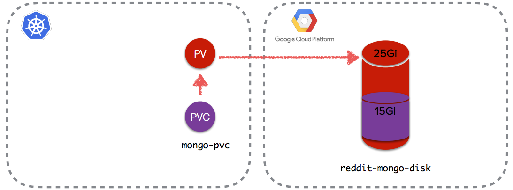

Если Claim не найдет по заданным параметрам PV внутри кластера, либо тот будет занят другим Claim’ом то он сам создаст нужный ему PV воспользовавшись стандартным StorageClass. 

```
$ kubectl describe storageclass standard -n dev 
```
> output
```
Name:                  standard
IsDefaultClass:        Yes
Annotations:           storageclass.beta.kubernetes.io/is-default-class=true
Provisioner:           kubernetes.io/gce-pd
Parameters:            type=pd-standard
AllowVolumeExpansion:  <unset>
MountOptions:          <none>
ReclaimPolicy:         Delete
VolumeBindingMode:     Immediate
Events:                <none>
```
В нашем случае это обычный медленный Google Cloud Persistent Drive:
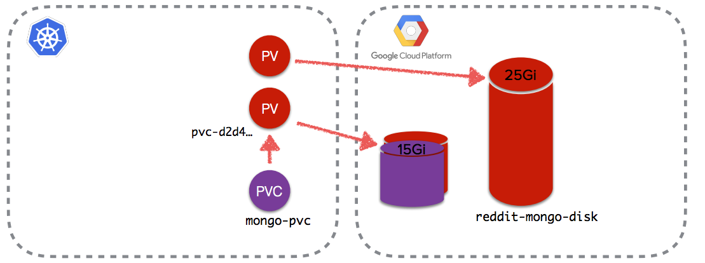

Подключим PVC к нашим Pod'ам:
```yml
mongo-deployment.yml 

---
apiVersion: apps/v1beta1
kind: Deployment
metadata:
  name: mongo
...
    spec:
      containers:
      - image: mongo:3.2
        name: mongo
        volumeMounts:
        - name: mongo-gce-pd-storage
          mountPath: /data/db
      volumes:
      - name: mongo-gce-pd-storage # Имя PersistentVolumeClame'а
        persistentVolumeClaim:
          claimName: mongo-pvc
```

Применим: `$ kubectl apply -f mongo-deployment.yml -n dev`

Монтируем выделенное по PVC хранилище к POD’у mongo:
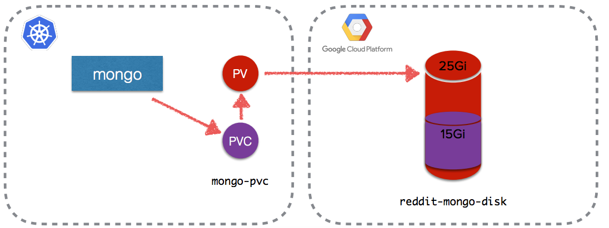

* Динамическое выделение Volume'ов

Создав PersistentVolume мы отделили объект "хранилища" от наших Service'ов и Pod'ов. Теперь мы можем его при необходимости переиспользовать.

Но нам гораздо интереснее создавать хранилища при необходимости и в автоматическом режиме. В этом нам помогут StorageClass’ы. Они описывают где (какой провайдер) и какие хранилища создаются. 

Cоздадим StorageClass Fast так, чтобы монтировались SSD-диски для работы нашего хранилища:

```yml
storage-fast.yml

---
kind: StorageClass
apiVersion: storage.k8s.io/v1beta1
metadata:
  name: fast # Имя StorageClass'а
provisioner: kubernetes.io/gce-pd # Провайдер хранилища
parameters:
  type: pd-ssd # Тип предоставляемого хранилища
```

Добавим StorageClass в кластер: `$ kubectl apply -f storage-fast.yml -n dev`

* PVC + StorageClass

Создадим описание PersistentVolumeClaim:
```yml
mongo-claim-dynamic.yml 

---
kind: PersistentVolumeClaim
apiVersion: v1
metadata:
  name: mongo-pvc-dynamic
spec:
  accessModes:
    - ReadWriteOnce
  storageClassName: fast # Вместо ссылки на созданный диск, теперь 
  resources:               # мы ссылаемся на StorageClass
    requests:
      storage: 10Gi
```

Добавим StorageClass в кластер:
```
$ kubectl apply -f mongo-claim-dynamic.yml -n dev
```

Подключение динамического PVC:
```yml
mongo-deployment.yml
---
apiVersion: apps/v1beta1
kind: Deployment
metadata:
  name: mongo
...
spec:
      containers:
      - image: mongo:3.2
        name: mongo
        volumeMounts:
        - name: mongo-gce-pd-storage
          mountPath: /data/db
      volumes:
      - name: mongo-gce-pd-storage
        persistentVolumeClaim:
          claimName: mongo-pvc-dynamic #Обновим PersistentVolumeClaim
```

Обновим описание нашего Deployment'а: `$ kubectl apply -f mongo-deployment.yml -n dev`

Список полученных PersistentVolume'ов:
```
$ kubectl get persistentvolume -n dev
```
> output
```
NAME                     CAPACITY  ACCESS MODES  RECLAIM POLICY   STATUS      CLAIM                   STORAGECLASS  AGE
pvc-4aa55cd3-2256-1..a   15Gi      RWO           Delete           Bound       dev/mongo-pvc           standard      23m
pvc-dcb0edd0-2258-1..a   10Gi      RWO           Delete           Bound       dev/mongo-pvc-dynamic   fast          5m
reddit-mongo-disk        25Gi      RWO           Retain           Available                                         28m
```

- Status - статус PV по отношению к Pod'ам и Claim'ам (Bound - связанный, Availible - доступный)
- Claim - к какому Claim'у привязан данный PV
- StorageClass - StorageClass данного PV


### Homework 22 (kubernetes-2)
[](https://travis-ci.com/Otus-DevOps-2018-09/ozyab09_microservices)

* Для локальной разработки необходимо:
- [kubectl](https://kubernetes.io/docs/tasks/tools/install-kubectl/)
- директория <i>~/.kube</i>
- minikube:
```
brew cask install minikube
```
или
```
curl -Lo minikube https://storage.googleapis.com/minikube/releases/v0.27.0/
minikube-darwin-amd64 && chmod +x minikube && sudo mv minikube /usr/local/
bin/
```

Для OS X понадобится гипервизор xhyve driver, VirtualBox, или VMware Fusion.

* Запуск Minicube-кластера: `minikube start`
> Если нужна конкретная версия kubernetes, следует указывать флаг `--kubernetes-version <version> (v1.8.0)`


> По-умолчанию используется VirtualBox. Если используется другой гипервизор, то необходим флаг `--vm-driver=<hypervisor `

* Minikube-кластер развернут. Автоматически был настроен конфиг kubectl.

Проверим: `kubectl get nodes`

> output:
```
NAME       STATUS   ROLES    AGE   VERSION
minikube   Ready    master   25s   v1.13.2
```
* Манифест kubernetes в формате yml:
```yml
~/.kube/config

apiVersion: v1
clusters: ## список кластеров
- cluster:
    certificate-authority: ~/.minikube/ca.crt
    server: https://192.168.99.100:8443
  name: minikube
contexts: ## список контекстов
- context:
    cluster: minikube
    user: minikube
  name: minikube
current-context: minikube
kind: Config
preferences: {}
users: ## список пользователей
- name: minikube
  user:
    client-certificate: ~/.minikube/client.crt
    client-key: ~/.minikube/client.key
```

* Обычный порядок конфигурирования <i>kubectl</i>:
1) Создание cluster'a:
```
$ kubectl config set-cluster … cluster_name
```
2) Создание данных пользователя (credentials):
```
$ kubectl config set-credentials … user_name
```
3) Создание контекста:
```
$ kubectl config set-context context_name \
  --cluster=cluster_name \
  --user=user_name
```
4) Использование контекста:
```
$ kubectl config use-context context_name
```
Таким образом, <i>kubectl</i> конфигурируется для подключения к разным кластерам, под разными пользователями. 

Текущий контекст: `$ kubectl config current-context`
> output
```
minikube
```
Список всех контекстов: `$ kubectl config get-contexts`

* Основные объекты - это ресурсы <i>Deployment</i>

Основные задачи <i>Deployment</i>:

1. Создание ReplicationSet (следит, чтобы число запущенных Pod-ов соответствовало описанному)
2. Ведение истории версий запущенных Pod-ов (для различных стратегий деплоя, для возможностей отката)
3. Описание процесса деплоя (стратегия, параметры стратегий)

* Файл <i>kubernetes/reddit/ui-deployment.yml</i>:
```yml
kubernetes/reddit/ui-deployment.yml

---
apiVersion: apps/v1beta2
kind: Deployment
metadata:
  name: ui
  labels:
    app: reddit
    component: ui
spec:
  replicas: 3
  selector:         ## selector описывает, как ему отслеживать POD-ы.
    matchLabels:    ## В данном случае - контроллер будет считать POD-ы с метками:
      app: reddit   ## app=reddit и component=ui
      component: ui
  template:
    metadata:
      name: ui-pod
      labels:       ## Поэтому важно в описании POD-а задать
        app: reddit ## нужные метки (labels) 
        component: ui
    spec:
      containers:
      - image: ozyab/ui
        name: ui
```

* Запуск в <i>Minikube</i> ui-компоненты:
```
$ kubectl apply -f ui-deployment.yml
```
> output
```
deployment "ui" created
```
Проверка запущенных deployment'ов:
```
$ kubectl get deployment 
```
> output
```
NAME   READY   UP-TO-DATE   AVAILABLE   AGE
ui     3/3     3            3           2m27s
```
`kubectl apply -f <filename>` может принимать не только отдельный файл, но и папку с ними. Например:
```
$ kubectl apply -f ./kubernetes/reddit 
```

* Используя <i>selector</i>, найдем POD-ы приложения:
```
$ kubectl get pods --selector component=ui 
```
> output
```
NAME                  READY   STATUS    RESTARTS   AGE
ui-84994b4554-5m4cb   1/1     Running   0          3m20s
ui-84994b4554-7gnqf   1/1     Running   0          3m25s
ui-84994b4554-zhfr6   1/1     Running   0          4m48s
```
Проброс порта на pod:
```
$ kubectl port-forward <pod-name> 8080:9292
```
> output
```
Forwarding from 127.0.0.1:8080 -> 9292
Forwarding from [::1]:8080 -> 9292
```
После этого можно перейти по адресу http://127.0.0.1:8080
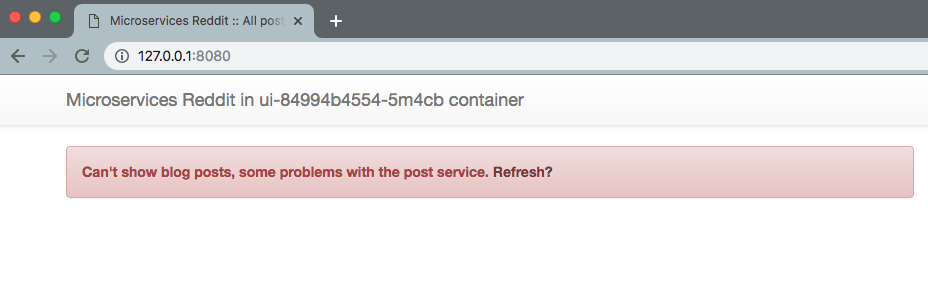


* Файл <i>kubernetes/reddit/comment-deployment.yml</i>:
```yml
kubernetes/reddit/comment-deployment.yml

---
apiVersion: apps/v1beta2
kind: Deployment
metadata:
  name: comment
  labels:
    app: reddit
    component: comment
spec:
  replicas: 3
  selector:
    matchLabels:
      app: reddit
      component: comment
  template:
    metadata:
      name: comment
      labels:
        app: reddit
        component: comment
    spec:
      containers:
      - image: ozyab/comment # Меняется только имя образа
        name: comment
```
* Запрос созданных подов:
```
$ kubectl get pods --selector component=comment
```

Выполнив проброс порта в pod, и перейдя по адресу http://127.0.0.1:8080/healthcheck увидим:

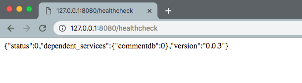

* Файл <i>kubernetes/reddit/post-deployment.yml</i>:
```yml
kubernetes/reddit/post-deployment.yml

---
apiVersion: apps/v1beta2
kind: Deployment
metadata:
  name: post
  labels:
    app: reddit
    component: post
spec:
  replicas: 3
  selector:
    matchLabels:
      app: reddit
      component: post
  template:
    metadata:
      name: post-pod
      labels:
        app: reddit
        component: post
    spec:
      containers:
      - image: ozyab/post
        name: post
```
Применение deployment: `kubectl apply -f post-deployment.yml`

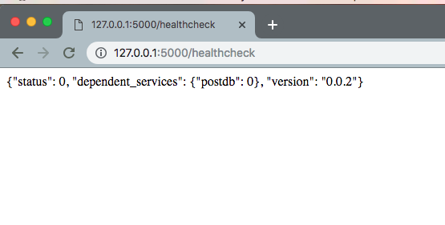

* Файл <i>kubernetes/reddit/mongo-deployment.yml</i>:
```yml
kubernetes/reddit/mongo-deployment.yml

---
apiVersion: apps/v1beta2
kind: Deployment
metadata:
  name: mongo
  labels:
    app: reddit
    component: mongo
spec:
  replicas: 1
  selector:
    matchLabels:
      app: reddit
      component: mongo
  template:
    metadata:
      name: mongo
      labels:
        app: reddit
        component: mongo
    spec:
      containers:
      - image: mongo:3.2
        name: mongo
        volumeMounts:   #точка монтирования в контейнере (не в POD-е)
        - name: mongo-persistent-storage
          mountPath: /data/db
      volumes:   #Ассоциированные с POD-ом Volume-ы
      - name: mongo-persistent-storage
        emptyDir: {}
```

* Для связи компонент между собой и с внешним миром используется объект Service - абстракция, которая определяет набор POD-ов (Endpoints) и способ доступа к ним.

Для связи ui с post и comment нужно создать им по объекту Service.

Файл <i>kubernetes/reddit/comment-service.yml</i>:
```yml
kubernetes/reddit/comment-service.yml

---
apiVersion: v1
kind: Service
metadata:
  name: comment  # в DNS появится запись для comment
  labels:
    app: reddit
    component: comment
spec:
  ports:           # При обращении на адрес post:9292 изнутри любого из POD-ов
  - port: 9292      # текущего namespace нас переправит на 9292-ный
    protocol: TCP    # порт одного из POD-ов приложения post,
    targetPort: 9292  # выбранных по label-ам
  selector:
    app: reddit
    component: comment
```
После применения `comment-service.yml` найдем по label'ам соответствующие PODы:
```
$ kubectl describe service comment | grep Endpoints
```
> output
```
Endpoints:   172.17.0.4:9292,172.17.0.6:9292,172.17.0.9:9292
```
Выполним команду `nslookup comment` из контейнера post:
```
$ kubectl get pods --selector component=post
NAME                    READY   STATUS    RESTARTS   AGE
post-5c45f6d5c8-5dpx7   1/1     Running   0          17m
post-5c45f6d5c8-cb8fv   1/1     Running   0          17m
post-5c45f6d5c8-k9s5h   1/1     Running   0          17m
$ kubectl exec -ti post-5c45f6d5c8-5dpx7 nslookup comment
nslookup: can't resolve '(null)': Name does not resolve
Name:      comment
Address 1: 10.105.95.41 comment.default.svc.cluster.local
```
Видим, что получен ответ от DNS.

* Аналогичным образом развернем service для post:
```yml
kubernetes/reddit/post-service.yml

---
apiVersion: v1
kind: Service
metadata:
  name: post 
  labels:
    app: reddit
    component: post
spec:
  ports:
  - port: 9292
    protocol: TCP
    targetPort: 9292
  selector:
    app: reddit
    component: post
```
* Post и Comment также используют mongodb, следовательно ей тоже нужен объект Service:
```yml
kubernetes/reddit/mongodb-service.yml

---
apiVersion: v1
kind: Service
metadata:
  name: mongodb
  labels:
    app: reddit
    component: mongo
spec:
  ports:
  - port: 27017
    protocol: TCP
    targetPort: 27017
  selector:
    app: reddit
    component: mongo
```
Деплой:
```
kubectl apply -f mongodb-service.yml
```

* Приложение ищет адрес comment_db, а не mongodb. Аналогично и сервис comment ищет post_db.

Эти адреса заданы в их Dockerfile-ах в виде переменных окружения:
```
post/Dockerfile
…
ENV POST_DATABASE_HOST=post_db
```
```
comment/Dockerfile
…
ENV COMMENT_DATABASE_HOST=comment_db
```
Создадим сервис:
```yml
comment-mongodb-service.yml

---
apiVersion: v1
kind: Service
metadata:
  name: comment-db
  labels:
    app: reddit
    component: mongo
    comment-db: "true" # метка, чтобы различать сервисы
spec:
  ports:
  - port: 27017
    protocol: TCP
    targetPort: 27017
  selector:
    app: reddit
    component: mongo
    comment-db: "true" # отдельный лейбл для comment-db
```
Файл <i>mongo-deployment.yml</i>:
```yml
kubernetes/reddit/mongo-deployment.yml

---
apiVersion: apps/v1beta2
kind: Deployment
metadata:
  name: mongo
  labels:
  ...
    comment-db: "true"
...
  template:
    metadata:
      name: mongo
      labels:
        ...
        comment-db: "true"
```
Файл <i>comment-deployment.yml</i>:
```yml
kubernetes/reddit/comment-deployment.yml

---
apiVersion: apps/v1beta2
kind: Deployment
metadata:
  name: comment
  labels:
    app: reddit
    component: comment
...
    spec:
      containers:
      - image: ozyab/comment
        name: comment
        env:
        - name: COMMENT_DATABASE_HOST
          value: comment-db
```
Также необходимо обновить файл <i>mongo-deployment.yml</i>, чтобы новый Service смог найти нужный POD:
```yml
kubernetes/reddit/mongo-deployment.yml

---
apiVersion: apps/v1beta2
kind: Deployment
metadata:
  name: mongo
  labels:
    ..
    comment-db: "true"
  template:
    metadata:
      name: mongo
      labels:
        ..
        comment-db: "true"
```

* Необходимо обеспечить доступ к ui-сервису снаружи. Для этого нам понадобится Service для UI-компоненты <i>ui-service.yml</i>:
```yml
kubernetes/reddit/ui-service.yml
...
  spec:
  - nodePort: 32092 #можно задать свой порт из диапазона 30000-32767
    type: NodePort
```
В описании service:
- <i>NodePort</i> - для доступа снаружи кластера
- <i>port</i> - для доступа к сервису изнутри кластера

Команда `minikube service ui` откроет в браузере страницу сервиса.

Список всех сервисов с URL: ` minikube services list`

#### Namespace

<i>Namespace</i> - это "виртуальный" кластер Kubernetes внутри самого Kubernetes. Внутри каждого такого кластера находятся свои объекты (POD-ы, Service-ы, Deployment-ы и т.д.), кроме объектов, общих на все namespace-ы (nodes, ClusterRoles, PersistentVolumes). 

В разных namespace-ах могут находится объекты с одинаковым именем, но в рамках одного namespace имена
объектов должны быть уникальны.

При старте Kubernetes кластер уже имеет 3 namespace:
- <i>default</i> - для объектов для которых не определен другой Namespace (в нем мы работали все это время)
- <i>kube-system</i> - для объектов созданных Kubernetes’ом и для управления им
- <i>kube-public</i> - для объектов к которым нужен доступ из любой точки кластера
Для того, чтобы выбрать конкретное пространство имен, нужно указать флаг `-n <namespace>` или `--namespace <namespace>` при запуске <i>kubectl</i>

* Отделим среду для разработки приложения от всего остального кластера, для чего создадим свой <i>Namespace</i> `dev`:
```
dev-namespace.yml: 

---
apiVersion: v1
kind: Namespace
metadata:
  name: dev
```
Создание namespace dev: `$ kubectl apply -f dev-namespace.yml`
* Добавим инфу об окружении внутрь контейнера UI:
```yml
kubernetes/reddit/ui-deployment.yml

---
apiVersion: apps/v1beta2
kind: Deployment
...
    spec:
      containers:
      ...
        env:
        - name: ENV #Извлекаем значения из контекста запуска
          valueFrom:
            fieldRef:
              fieldPath: metadata.namespace
```
После этого: `$ kubectl apply -f ui-deployment.yml -n dev`

#### Разворачиваем Kubernetes в GKE (Google Kubernetes Engine)

Переходим на страницу Kubernetes Engine: https://console.cloud.google.com/kubernetes/list?project=${PROJECT_NAME}
и создаем кластер.

Компоненты управления кластером запускаются в container engine и управляются Google:
- kube-apiserver
- kube-scheduler
- kube-controller-manager
- etcd 
Рабочая нагрузка (собственные POD-ы), аддоны, мониторинг, логирование и т.д. запускаются на рабочих нодах.
Рабочие ноды - стандартные ноды Google compute engine. Их можно увидеть в списке запущенных узлов. 

Подключимся к GKE для запуска нашего приложения. Для этого жмем <i>Подключиться</i> на странице кластеров.
Будет выдана команда
```
gcloud container clusters get-credentials standard-cluster-1 --zone us-central1-a --project ${PROJECT_NAME}
```
В файл <i>~/.kube/config</i> будут добавлены <i>user</i>, <i>cluster</i> и <i>context</i> для подключения к кластеру в GKE. Также текущий контекст будет выставлен для подключения к этому кластеру.

Проверим текущий контекст: `$ kubectl config current-context`
> output:
```
gke_keen-${PROJECT_NAME}_us-central1-a_standard-cluster-1
```
Создадим dev namespace: `$ kubectl apply -f ./kubernetes/reddit/dev-namespace.yml`

Деплой всех приложений в namespace dev: `$ kubectl apply -f ./kubernetes/reddit/ -n dev`

Открытие диапазона kubernetes портов в firewall:
```gcloud compute --project=${PROJECT_NAME} \
     firewall-rules create kubernetes-nodeports \
     --direction=INGRESS \
     --priority=1000 \
     --network=default \
     --action=ALLOW \
     --rules=tcp:30000-32767 \
     --source-ranges=0.0.0.0/0
```
* Найдем внешний IP-адрес любой ноды из кластера: `$ kubectl get nodes -o wide`
```
NAME                                                STATUS   ROLES    AGE   VERSION         EXTERNAL-IP
gke-standard-cluster-1-default-pool-2dd96181-qt7q   Ready    <none>   11h   v1.10.9-gke.5   XX.XXX.XX.XXX
gke-standard-cluster-1-default-pool-d3cd4782-7j9s   Ready    <none>   11h   v1.10.9-gke.5   XX.XXX.XX.XXX
```
Порт публикации сервиса <i>ui</i>: `$ kubectl describe service ui -n dev | grep NodePort`
```
Type:                     NodePort
NodePort:                 <unset>  32092/TCP
```
Можно перейти на любой из внешних IP-адресов для открытия страницы http://XX.XXX.XX.XXX:32092

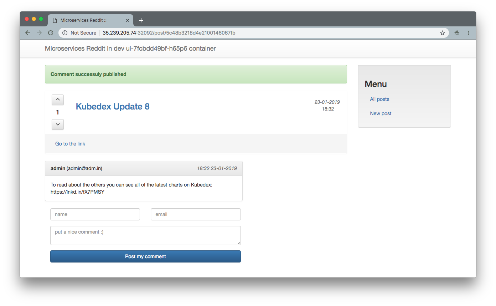

### Homework 21 (kubernetes-1)
[](https://travis-ci.com/Otus-DevOps-2018-09/ozyab09_microservices)

* Creted new Deploement manifests in <i>kubernetes/reddit</i> folder:
```
comment-deployment.yml
mongo-deployment.yml
post-deployment.yml
ui-deployment.yml
```

### [Kubernetes The Hard Way](https://github.com/kelseyhightower/kubernetes-the-hard-way)

This lab assumes you have access to the <i>Google Cloud Platform</i>. This lab we use <i>MacOS</i>.

#### Prerequisites

* Install the <i>Google Cloud SDK</i>

Follow the <i>Google Cloud SDK</i> [documentation](https://cloud.google.com/sdk/) to install and configure the gcloud command line utility.

Verify the Google Cloud SDK version is 218.0.0 or higher: `gcloud version`

* Default Compute Region and Zone
The easiest way to set default compute region: `gcloud init`.

Otherwise set a default compute region: `gcloud config set compute/region us-west1`.

Set a default compute zone: `gcloud config set compute/zone us-west1-c`.

#### Installing the Client Tools

* Install CFSSL

The <i>cfssl</i> and <i>cfssljson</i> command line utilities will be used to provision a [PKI Infrastructure](https://en.wikipedia.org/wiki/Public_key_infrastructure) and generate TLS certificates.

Installing <i>cfssl</i> and <i>cfssljson</i> using packet manager <i>brew</i>: `brew install cfssl`.

* Verification Installing
```
cfssl version
```
* Install </i>kubectl</i>

The <i>kubectl</i> command line utility is used to interact with the Kubernetes API Server.

* Download and install <i>kubectl</i> from the official release binaries:
```
curl -o kubectl https://storage.googleapis.com/kubernetes-release/release/v1.12.0/bin/darwin/amd64/kubectl
chmod +x kubectl
sudo mv kubectl /usr/local/bin/
```
* Verify <i>kubectl</i> version 1.12.0 or higher is installed:
```
kubectl version --client
```

#### Provisioning Compute Resources

* Virtual Private Cloud Network
Create the <i>kubernetes-the-hard-way</i> custom VPC network:
```
gcloud compute networks create kubernetes-the-hard-way --subnet-mode custom
```
A subnet must be provisioned with an IP address range large enough to assign a private IP address to each node in the <i>Kubernetes</i> cluster.

Create the <i>kubernetes</i> subnet in the <i>kubernetes-the-hard-way</i> VPC network:
```
gcloud compute networks subnets create kubernetes \
  --network kubernetes-the-hard-way \
  --range 10.240.0.0/24
```
The <i>10.240.0.0/24</i> IP address range can host up to 254 compute instances.

* Firewall

Create a firewall rule that allows internal communication across all protocols:
```
gcloud compute firewall-rules create kubernetes-the-hard-way-allow-internal \
  --allow tcp,udp,icmp \
  --network kubernetes-the-hard-way \
  --source-ranges 10.240.0.0/24,10.200.0.0/16
```
Create a firewall rule that allows external SSH, ICMP, and HTTPS:
```
gcloud compute firewall-rules create kubernetes-the-hard-way-allow-external \
  --allow tcp:22,tcp:6443,icmp \
  --network kubernetes-the-hard-way \
  --source-ranges 0.0.0.0/0
```
List the firewall rules in the <i>kubernetes-the-hard-way</i> VPC network:
```
gcloud compute firewall-rules list --filter="network:kubernetes-the-hard-way"
```
> output
```
NAME                                    NETWORK                  DIRECTION  PRIORITY  ALLOW                 DENY  DISABLED
kubernetes-the-hard-way-allow-external  kubernetes-the-hard-way  INGRESS    1000      tcp:22,tcp:6443,icmp        False
kubernetes-the-hard-way-allow-internal  kubernetes-the-hard-way  INGRESS    1000      tcp,udp,icmp                False
```
* Kubernetes Public IP Address

Allocate a static IP address that will be attached to the external load balancer fronting the Kubernetes API Servers:
```
gcloud compute addresses create kubernetes-the-hard-way \
  --region $(gcloud config get-value compute/region)
```
Verify the <i>kubernetes-the-hard-way</i> static IP address was created in your default compute region:
```
gcloud compute addresses list --filter="name=('kubernetes-the-hard-way')"
```
* Compute Instances
The compute instances in this lab will be provisioned using Ubuntu Server 18.04, which has good support for the containerd container runtime. Each compute instance will be provisioned with a fixed private IP address to simplify the Kubernetes bootstrapping process.

* Kubernetes Controllers
Create three compute instances which will host the Kubernetes control plane:
```
for i in 0 1 2; do
  gcloud compute instances create controller-${i} \
    --async \
    --boot-disk-size 200GB \
    --can-ip-forward \
    --image-family ubuntu-1804-lts \
    --image-project ubuntu-os-cloud \
    --machine-type n1-standard-1 \
    --private-network-ip 10.240.0.1${i} \
    --scopes compute-rw,storage-ro,service-management,service-control,logging-write,monitoring \
    --subnet kubernetes \
    --tags kubernetes-the-hard-way,controller
done
```
* Kubernetes Workers
Each worker instance requires a pod subnet allocation from the Kubernetes cluster CIDR range. The pod subnet allocation will be used to configure container networking in a later exercise. The <i>pod-cidr</i> instance metadata will be used to expose pod subnet allocations to compute instances at runtime.

The Kubernetes cluster CIDR range is defined by the Controller Manager's `--cluster-cidr` flag. In this tutorial the cluster CIDR range will be set to <i>10.200.0.0/16</i>, which supports 254 subnets.

Create three compute instances which will host the <i>Kubernetes</i> worker nodes:
```
for i in 0 1 2; do
  gcloud compute instances create worker-${i} \
    --async \
    --boot-disk-size 200GB \
    --can-ip-forward \
    --image-family ubuntu-1804-lts \
    --image-project ubuntu-os-cloud \
    --machine-type n1-standard-1 \
    --metadata pod-cidr=10.200.${i}.0/24 \
    --private-network-ip 10.240.0.2${i} \
    --scopes compute-rw,storage-ro,service-management,service-control,logging-write,monitoring \
    --subnet kubernetes \
    --tags kubernetes-the-hard-way,worker
done
```
* Verification
List the compute instances in your default compute zone:
```
gcloud compute instances list
```
> output
```
NAME          ZONE            MACHINE_TYPE               PREEMPTIBLE  INTERNAL_IP  EXTERNAL_IP     STATUS
controller-0  europe-west4-a  n1-standard-1                           10.240.0.10  X.X.X.X         RUNNING
controller-1  europe-west4-a  n1-standard-1                           10.240.0.11  X.X.X.X         RUNNING
controller-2  europe-west4-a  n1-standard-1                           10.240.0.12  X.X.X.X         RUNNING
worker-0      europe-west4-a  n1-standard-1                           10.240.0.20  X.X.X.X         RUNNING
worker-1      europe-west4-a  n1-standard-1                           10.240.0.21  X.X.X.X         RUNNING
worker-2      europe-west4-a  n1-standard-1                           10.240.0.22  X.X.X.X         RUNNING
```

* Configuring SSH Access
SSH will be used to configure the controller and worker instances. When connecting to compute instances for the first time SSH keys will be generated for you and stored in the project or instance metadata as describe in the [connecting to instances](https://cloud.google.com/compute/docs/instances/connecting-to-instance) documentation.

Test SSH access to the <i>controller-0</i> compute instances:
```
gcloud compute ssh controller-0
```
If this is your first time connecting to a compute instance SSH keys will be generated for you.

#### Provisioning a CA and Generating TLS Certificates

* Certificate Authority

Generate the CA configuration file, certificate, and private key:

```
cat > ca-config.json <<EOF
{
  "signing": {
    "default": {
      "expiry": "8760h"
    },
    "profiles": {
      "kubernetes": {
        "usages": ["signing", "key encipherment", "server auth", "client auth"],
        "expiry": "8760h"
      }
    }
  }
}
EOF

cat > ca-csr.json <<EOF
{
  "CN": "Kubernetes",
  "key": {
    "algo": "rsa",
    "size": 2048
  },
  "names": [
    {
      "C": "US",
      "L": "Portland",
      "O": "Kubernetes",
      "OU": "CA",
      "ST": "Oregon"
    }
  ]
}
EOF

cfssl gencert -initca ca-csr.json | cfssljson -bare ca
```

* Client and Server Certificates

Generate the admin client certificate and private key:

```
cat > admin-csr.json <<EOF
{
  "CN": "admin",
  "key": {
    "algo": "rsa",
    "size": 2048
  },
  "names": [
    {
      "C": "US",
      "L": "Portland",
      "O": "system:masters",
      "OU": "Kubernetes The Hard Way",
      "ST": "Oregon"
    }
  ]
}
EOF

cfssl gencert \
  -ca=ca.pem \
  -ca-key=ca-key.pem \
  -config=ca-config.json \
  -profile=kubernetes \
  admin-csr.json | cfssljson -bare admin
```

* The Kubelet Client Certificates

Kubernetes uses a [special-purpose authorization mode](https://kubernetes.io/docs/admin/authorization/node/) called Node Authorizer, that specifically authorizes API requests made by [Kubelets](https://kubernetes.io/docs/concepts/overview/components/#kubelet). 

Generate a certificate and private key for each Kubernetes worker node:
```
for instance in worker-0 worker-1 worker-2; do
cat > ${instance}-csr.json <<EOF
{
  "CN": "system:node:${instance}",
  "key": {
    "algo": "rsa",
    "size": 2048
  },
  "names": [
    {
      "C": "US",
      "L": "Portland",
      "O": "system:nodes",
      "OU": "Kubernetes The Hard Way",
      "ST": "Oregon"
    }
  ]
}
EOF

EXTERNAL_IP=$(gcloud compute instances describe ${instance} \
  --format 'value(networkInterfaces[0].accessConfigs[0].natIP)')

INTERNAL_IP=$(gcloud compute instances describe ${instance} \
  --format 'value(networkInterfaces[0].networkIP)')

cfssl gencert \
  -ca=ca.pem \
  -ca-key=ca-key.pem \
  -config=ca-config.json \
  -hostname=${instance},${EXTERNAL_IP},${INTERNAL_IP} \
  -profile=kubernetes \
  ${instance}-csr.json | cfssljson -bare ${instance}
done
```

* The Controller Manager Client Certificate

Generate the <i>kube-controller-manager</i> client certificate and private key:
```
cat > kube-controller-manager-csr.json <<EOF
{
  "CN": "system:kube-controller-manager",
  "key": {
    "algo": "rsa",
    "size": 2048
  },
  "names": [
    {
      "C": "US",
      "L": "Portland",
      "O": "system:kube-controller-manager",
      "OU": "Kubernetes The Hard Way",
      "ST": "Oregon"
    }
  ]
}
EOF

cfssl gencert \
  -ca=ca.pem \
  -ca-key=ca-key.pem \
  -config=ca-config.json \
  -profile=kubernetes \
  kube-controller-manager-csr.json | cfssljson -bare kube-controller-manager

```

* The Kube Proxy Client Certificate

Generate the <i>kube-proxy</i> client certificate and private key:
```
cat > kube-proxy-csr.json <<EOF
{
  "CN": "system:kube-proxy",
  "key": {
    "algo": "rsa",
    "size": 2048
  },
  "names": [
    {
      "C": "US",
      "L": "Portland",
      "O": "system:node-proxier",
      "OU": "Kubernetes The Hard Way",
      "ST": "Oregon"
    }
  ]
}
EOF

cfssl gencert \
  -ca=ca.pem \
  -ca-key=ca-key.pem \
  -config=ca-config.json \
  -profile=kubernetes \
  kube-proxy-csr.json | cfssljson -bare kube-proxy
```

* The Scheduler Client Certificate

Generate the <i>kube-scheduler</i> client certificate and private key:
```
cat > kube-scheduler-csr.json <<EOF
{
  "CN": "system:kube-scheduler",
  "key": {
    "algo": "rsa",
    "size": 2048
  },
  "names": [
    {
      "C": "US",
      "L": "Portland",
      "O": "system:kube-scheduler",
      "OU": "Kubernetes The Hard Way",
      "ST": "Oregon"
    }
  ]
}
EOF

cfssl gencert \
  -ca=ca.pem \
  -ca-key=ca-key.pem \
  -config=ca-config.json \
  -profile=kubernetes \
  kube-scheduler-csr.json | cfssljson -bare kube-scheduler
```

* The Kubernetes API Server Certificate


The kubernetes-the-hard-way static IP address will be included in the list of subject alternative names for the Kubernetes API Server certificate. This will ensure the certificate can be validated by remote clients.

Generate the Kubernetes API Server certificate and private key:

```
KUBERNETES_PUBLIC_ADDRESS=$(gcloud compute addresses describe kubernetes-the-hard-way \
  --region $(gcloud config get-value compute/region) \
  --format 'value(address)')

cat > kubernetes-csr.json <<EOF
{
  "CN": "kubernetes",
  "key": {
    "algo": "rsa",
    "size": 2048
  },
  "names": [
    {
      "C": "US",
      "L": "Portland",
      "O": "Kubernetes",
      "OU": "Kubernetes The Hard Way",
      "ST": "Oregon"
    }
  ]
}
EOF

cfssl gencert \
  -ca=ca.pem \
  -ca-key=ca-key.pem \
  -config=ca-config.json \
  -hostname=10.32.0.1,10.240.0.10,10.240.0.11,10.240.0.12,${KUBERNETES_PUBLIC_ADDRESS},127.0.0.1,kubernetes.default \
  -profile=kubernetes \
  kubernetes-csr.json | cfssljson -bare kubernetes
```

* The Service Account Key Pair

The Kubernetes Controller Manager leverages a key pair to generate and sign service account tokens as describe in the [managing service accounts](https://kubernetes.io/docs/admin/service-accounts-admin/) documentation.

Generate the <i>service-account</i> certificate and private key:
```
cat > service-account-csr.json <<EOF
{
  "CN": "service-accounts",
  "key": {
    "algo": "rsa",
    "size": 2048
  },
  "names": [
    {
      "C": "US",
      "L": "Portland",
      "O": "Kubernetes",
      "OU": "Kubernetes The Hard Way",
      "ST": "Oregon"
    }
  ]
}
EOF

cfssl gencert \
  -ca=ca.pem \
  -ca-key=ca-key.pem \
  -config=ca-config.json \
  -profile=kubernetes \
  service-account-csr.json | cfssljson -bare service-account
```

* Distribute the Client and Server Certificates

Copy the appropriate certificates and private keys to each worker instance:
```
for instance in worker-0 worker-1 worker-2; do
  gcloud compute scp ca.pem ${instance}-key.pem ${instance}.pem ${instance}:~/
done
```
Copy the appropriate certificates and private keys to each controller instance:
```
for instance in controller-0 controller-1 controller-2; do
  gcloud compute scp ca.pem ca-key.pem kubernetes-key.pem kubernetes.pem \
    service-account-key.pem service-account.pem ${instance}:~/
done
```

#### Generating Kubernetes Configuration Files for Authentication
In this lab you will generate [Kubernetes configuration files](https://kubernetes.io/docs/concepts/configuration/organize-cluster-access-kubeconfig/), also known as kubeconfigs, which enable Kubernetes clients to locate and authenticate to the Kubernetes API Servers.

In this section you will generate kubeconfig files for the <i>controller manager</i>, <i>kubelet</i>, <i>kube-proxy</i>, <i>and scheduler</i> clients and the <i>admin</i> user.

* Kubernetes Public IP Address
Each kubeconfig requires a Kubernetes API Server to connect to. To support high availability the IP address assigned to the external load balancer fronting the Kubernetes API Servers will be used.

Retrieve the <i>kubernetes-the-hard-way</i> static IP address:

```json
KUBERNETES_PUBLIC_ADDRESS=$(gcloud compute addresses describe kubernetes-the-hard-way \
  --region $(gcloud config get-value compute/region) \
  --format 'value(address)')
```

* The kubelet Kubernetes Configuration File

When generating kubeconfig files for Kubelets the client certificate matching the Kubelet's node name must be used. This will ensure Kubelets are properly authorized by the Kubernetes [Node Authorizer](https://kubernetes.io/docs/admin/authorization/node/).

Generate a kubeconfig file for each worker node:

```
for instance in worker-0 worker-1 worker-2; do
  kubectl config set-cluster kubernetes-the-hard-way \
    --certificate-authority=ca.pem \
    --embed-certs=true \
    --server=https://${KUBERNETES_PUBLIC_ADDRESS}:6443 \
    --kubeconfig=${instance}.kubeconfig

  kubectl config set-credentials system:node:${instance} \
    --client-certificate=${instance}.pem \
    --client-key=${instance}-key.pem \
    --embed-certs=true \
    --kubeconfig=${instance}.kubeconfig

  kubectl config set-context default \
    --cluster=kubernetes-the-hard-way \
    --user=system:node:${instance} \
    --kubeconfig=${instance}.kubeconfig

  kubectl config use-context default --kubeconfig=${instance}.kubeconfig
done
```

* The kube-proxy Kubernetes Configuration File

Generate a kubeconfig file for the <i>kube-proxy</i> service:

```json
  kubectl config set-cluster kubernetes-the-hard-way \
    --certificate-authority=ca.pem \
    --embed-certs=true \
    --server=https://${KUBERNETES_PUBLIC_ADDRESS}:6443 \
    --kubeconfig=kube-proxy.kubeconfig

  kubectl config set-credentials system:kube-proxy \
    --client-certificate=kube-proxy.pem \
    --client-key=kube-proxy-key.pem \
    --embed-certs=true \
    --kubeconfig=kube-proxy.kubeconfig

  kubectl config set-context default \
    --cluster=kubernetes-the-hard-way \
    --user=system:kube-proxy \
    --kubeconfig=kube-proxy.kubeconfig

  kubectl config use-context default --kubeconfig=kube-proxy.kubeconfig
```

* The kube-controller-manager Kubernetes Configuration File

Generate a kubeconfig file for the <i>kube-controller-manager</i> service:
```
  kubectl config set-cluster kubernetes-the-hard-way \
    --certificate-authority=ca.pem \
    --embed-certs=true \
    --server=https://127.0.0.1:6443 \
    --kubeconfig=kube-controller-manager.kubeconfig

  kubectl config set-credentials system:kube-controller-manager \
    --client-certificate=kube-controller-manager.pem \
    --client-key=kube-controller-manager-key.pem \
    --embed-certs=true \
    --kubeconfig=kube-controller-manager.kubeconfig

  kubectl config set-context default \
    --cluster=kubernetes-the-hard-way \
    --user=system:kube-controller-manager \
    --kubeconfig=kube-controller-manager.kubeconfig

  kubectl config use-context default --kubeconfig=kube-controller-manager.kubeconfig
```

* The kube-scheduler Kubernetes Configuration File

Generate a kubeconfig file for the <i>kube-scheduler</i> service:
```json
  kubectl config set-cluster kubernetes-the-hard-way \
    --certificate-authority=ca.pem \
    --embed-certs=true \
    --server=https://127.0.0.1:6443 \
    --kubeconfig=kube-scheduler.kubeconfig

  kubectl config set-credentials system:kube-scheduler \
    --client-certificate=kube-scheduler.pem \
    --client-key=kube-scheduler-key.pem \
    --embed-certs=true \
    --kubeconfig=kube-scheduler.kubeconfig

  kubectl config set-context default \
    --cluster=kubernetes-the-hard-way \
    --user=system:kube-scheduler \
    --kubeconfig=kube-scheduler.kubeconfig

  kubectl config use-context default --kubeconfig=kube-scheduler.kubeconfig
```

* The admin Kubernetes Configuration File

Generate a kubeconfig file for the <i>admin</i> user:
```json
  kubectl config set-cluster kubernetes-the-hard-way \
    --certificate-authority=ca.pem \
    --embed-certs=true \
    --server=https://127.0.0.1:6443 \
    --kubeconfig=admin.kubeconfig

  kubectl config set-credentials admin \
    --client-certificate=admin.pem \
    --client-key=admin-key.pem \
    --embed-certs=true \
    --kubeconfig=admin.kubeconfig

  kubectl config set-context default \
    --cluster=kubernetes-the-hard-way \
    --user=admin \
    --kubeconfig=admin.kubeconfig

  kubectl config use-context default --kubeconfig=admin.kubeconfig
```

* Distribute the Kubernetes Configuration Files
Copy the appropriate <i>kubelet</i> and <i>kube-proxy</i> kubeconfig files to each worker instance:
```
for instance in worker-0 worker-1 worker-2; do
  gcloud compute scp ${instance}.kubeconfig kube-proxy.kubeconfig ${instance}:~/
done
```
Copy the appropriate <i>kube-controller-manager</i> and <i>kube-scheduler</i> kubeconfig files to each controller instance:
```
for instance in controller-0 controller-1 controller-2; do
  gcloud compute scp admin.kubeconfig kube-controller-manager.kubeconfig kube-scheduler.kubeconfig ${instance}:~/
done
```

#### Generating the Data Encryption Config and Key
Kubernetes stores a variety of data including cluster state, application configurations, and secrets. Kubernetes supports the ability to [encrypt](https://kubernetes.io/docs/tasks/administer-cluster/encrypt-data) cluster data at rest.

In this lab you will generate an encryption key and an [encryption config](https://kubernetes.io/docs/tasks/administer-cluster/encrypt-data/#understanding-the-encryption-at-rest-configuration) suitable for encrypting Kubernetes Secrets.

* The Encryption Key

Generate an encryption key:
```
ENCRYPTION_KEY=$(head -c 32 /dev/urandom | base64)
```

* The Encryption Config File
Create the <i>encryption-config.yaml</i> encryption config file:
```yml
cat > encryption-config.yaml <<EOF
kind: EncryptionConfig
apiVersion: v1
resources:
  - resources:
      - secrets
    providers:
      - aescbc:
          keys:
            - name: key1
              secret: ${ENCRYPTION_KEY}
      - identity: {}
EOF
```

Copy the encryption-config.yaml encryption config file to each controller instance:
```json
for instance in controller-0 controller-1 controller-2; do
  gcloud compute scp encryption-config.yaml ${instance}:~/
done
```

#### Bootstrapping the etcd Cluster

Kubernetes components are stateless and store cluster state in [etcd](https://github.com/coreos/etcd). In this lab you will bootstrap a three node etcd cluster and configure it for high availability and secure remote access.

* Prerequisites

The commands in this lab must be run on each controller instance: <i>controller-0</i>, <i>controller-1</i>, and <i>controller-2</i>. Login to each controller instance using the <i>gcloud</i> command. Example: `gcloud compute ssh controller-0`

* Bootstrapping an etcd Cluster Member

Download and Install the etcd Binaries from the [coreos/etcd](https://github.com/coreos/etcd) GitHub project:
```
wget -q --show-progress --https-only --timestamping \
  "https://github.com/coreos/etcd/releases/download/v3.3.9/etcd-v3.3.9-linux-amd64.tar.gz"
```

Extract and install the <i>etcd</i> server and the <i>etcdctl</i> command line utility:
```
  tar -xvf etcd-v3.3.9-linux-amd64.tar.gz
  sudo mv etcd-v3.3.9-linux-amd64/etcd* /usr/local/bin/
```
* Configure the etcd Server
```
  sudo mkdir -p /etc/etcd /var/lib/etcd
  sudo cp ca.pem kubernetes-key.pem kubernetes.pem /etc/etcd/
```
The instance internal IP address will be used to serve client requests and communicate with etcd cluster peers. Retrieve the internal IP address for the current compute instance:
```
INTERNAL_IP=$(curl -s -H "Metadata-Flavor: Google" \
  http://metadata.google.internal/computeMetadata/v1/instance/network-interfaces/0/ip)
```
Each etcd member must have a unique name within an etcd cluster. Set the etcd name to match the hostname of the current compute instance:
```
ETCD_NAME=$(hostname -s)
```
Create the <i>etcd.service</i> systemd unit file:
```
cat <<EOF | sudo tee /etc/systemd/system/etcd.service
[Unit]
Description=etcd
Documentation=https://github.com/coreos

[Service]
ExecStart=/usr/local/bin/etcd \\
  --name ${ETCD_NAME} \\
  --cert-file=/etc/etcd/kubernetes.pem \\
  --key-file=/etc/etcd/kubernetes-key.pem \\
  --peer-cert-file=/etc/etcd/kubernetes.pem \\
  --peer-key-file=/etc/etcd/kubernetes-key.pem \\
  --trusted-ca-file=/etc/etcd/ca.pem \\
  --peer-trusted-ca-file=/etc/etcd/ca.pem \\
  --peer-client-cert-auth \\
  --client-cert-auth \\
  --initial-advertise-peer-urls https://${INTERNAL_IP}:2380 \\
  --listen-peer-urls https://${INTERNAL_IP}:2380 \\
  --listen-client-urls https://${INTERNAL_IP}:2379,https://127.0.0.1:2379 \\
  --advertise-client-urls https://${INTERNAL_IP}:2379 \\
  --initial-cluster-token etcd-cluster-0 \\
  --initial-cluster controller-0=https://10.240.0.10:2380,controller-1=https://10.240.0.11:2380,controller-2=https://10.240.0.12:2380 \\
  --initial-cluster-state new \\
  --data-dir=/var/lib/etcd
Restart=on-failure
RestartSec=5

[Install]
WantedBy=multi-user.target
EOF
```
* Start the etcd Server
```
  sudo systemctl daemon-reload
  sudo systemctl enable etcd
  sudo systemctl start etcd
```

* Verification

List the etcd cluster members:

```
sudo ETCDCTL_API=3 etcdctl member list \
   --endpoints=https://127.0.0.1:2379 \
   --cacert=/etc/etcd/ca.pem \
   --cert=/etc/etcd/kubernetes.pem \
   --key=/etc/etcd/kubernetes-key.pem
```
> output:
```
3a57933972cb5131, started, controller-2, https://10.240.0.12:2380, https://10.240.0.12:2379
f98dc20bce6225a0, started, controller-0, https://10.240.0.10:2380, https://10.240.0.10:2379
ffed16798470cab5, started, controller-1, https://10.240.0.11:2380, https://10.240.0.11:2379
```

#### Bootstrapping the Kubernetes Control Plane

In this lab you will bootstrap the Kubernetes control plane across three compute instances and configure it for high availability. You will also create an external load balancer that exposes the Kubernetes API Servers to remote clients. The following components will be installed on each node: Kubernetes API Server, Scheduler, and Controller Manager.

The commands in this lab must be run on each controller instance: <i>controller-0</i>, <i>controller-1</i>, and <i>controller-2</i>. Login to each controller instance using the gcloud command. Example: `gcloud compute ssh controller-0`

* Provision the Kubernetes Control Plane

Create the Kubernetes configuration directory:

```
sudo mkdir -p /etc/kubernetes/config
```

* Download and Install the Kubernetes Controller Binaries

Download the official Kubernetes release binaries:
```
wget -q --show-progress --https-only --timestamping \
  "https://storage.googleapis.com/kubernetes-release/release/v1.12.0/bin/linux/amd64/kube-apiserver" \
  "https://storage.googleapis.com/kubernetes-release/release/v1.12.0/bin/linux/amd64/kube-controller-manager" \
  "https://storage.googleapis.com/kubernetes-release/release/v1.12.0/bin/linux/amd64/kube-scheduler" \
  "https://storage.googleapis.com/kubernetes-release/release/v1.12.0/bin/linux/amd64/kubectl"
```

* Install the Kubernetes binaries:

```
chmod +x kube-apiserver kube-controller-manager kube-scheduler kubectl
sudo mv kube-apiserver kube-controller-manager kube-scheduler kubectl /usr/local/bin/
```

* Configure the Kubernetes API Server
```
  sudo mkdir -p /var/lib/kubernetes/

  sudo mv ca.pem ca-key.pem kubernetes-key.pem kubernetes.pem \
    service-account-key.pem service-account.pem \
    encryption-config.yaml /var/lib/kubernetes/
```

The instance internal IP address will be used to advertise the API Server to members of the cluster. Retrieve the internal IP address for the current compute instance:
```
INTERNAL_IP=$(curl -s -H "Metadata-Flavor: Google" \
  http://metadata.google.internal/computeMetadata/v1/instance/network-interfaces/0/ip)
```

Create the <i>kube-apiserver.service</i> systemd unit file:
```
cat <<EOF | sudo tee /etc/systemd/system/kube-apiserver.service
[Unit]
Description=Kubernetes API Server
Documentation=https://github.com/kubernetes/kubernetes

[Service]
ExecStart=/usr/local/bin/kube-apiserver \\
  --advertise-address=${INTERNAL_IP} \\
  --allow-privileged=true \\
  --apiserver-count=3 \\
  --audit-log-maxage=30 \\
  --audit-log-maxbackup=3 \\
  --audit-log-maxsize=100 \\
  --audit-log-path=/var/log/audit.log \\
  --authorization-mode=Node,RBAC \\
  --bind-address=0.0.0.0 \\
  --client-ca-file=/var/lib/kubernetes/ca.pem \\
  --enable-admission-plugins=Initializers,NamespaceLifecycle,NodeRestriction,LimitRanger,ServiceAccount,DefaultStorageClass,ResourceQuota \\
  --enable-swagger-ui=true \\
  --etcd-cafile=/var/lib/kubernetes/ca.pem \\
  --etcd-certfile=/var/lib/kubernetes/kubernetes.pem \\
  --etcd-keyfile=/var/lib/kubernetes/kubernetes-key.pem \\
  --etcd-servers=https://10.240.0.10:2379,https://10.240.0.11:2379,https://10.240.0.12:2379 \\
  --event-ttl=1h \\
  --experimental-encryption-provider-config=/var/lib/kubernetes/encryption-config.yaml \\
  --kubelet-certificate-authority=/var/lib/kubernetes/ca.pem \\
  --kubelet-client-certificate=/var/lib/kubernetes/kubernetes.pem \\
  --kubelet-client-key=/var/lib/kubernetes/kubernetes-key.pem \\
  --kubelet-https=true \\
  --runtime-config=api/all \\
  --service-account-key-file=/var/lib/kubernetes/service-account.pem \\
  --service-cluster-ip-range=10.32.0.0/24 \\
  --service-node-port-range=30000-32767 \\
  --tls-cert-file=/var/lib/kubernetes/kubernetes.pem \\
  --tls-private-key-file=/var/lib/kubernetes/kubernetes-key.pem \\
  --v=2
Restart=on-failure
RestartSec=5

[Install]
WantedBy=multi-user.target
EOF
```

* Configure the Kubernetes Controller Manager

Move the <i>kube-controller-manager</i> kubeconfig into place:
```
sudo mv kube-controller-manager.kubeconfig /var/lib/kubernetes/
```
Create the <i>kube-controller-manager.service</i> systemd unit file:
```
cat <<EOF | sudo tee /etc/systemd/system/kube-controller-manager.service
[Unit]
Description=Kubernetes Controller Manager
Documentation=https://github.com/kubernetes/kubernetes

[Service]
ExecStart=/usr/local/bin/kube-controller-manager \\
  --address=0.0.0.0 \\
  --cluster-cidr=10.200.0.0/16 \\
  --cluster-name=kubernetes \\
  --cluster-signing-cert-file=/var/lib/kubernetes/ca.pem \\
  --cluster-signing-key-file=/var/lib/kubernetes/ca-key.pem \\
  --kubeconfig=/var/lib/kubernetes/kube-controller-manager.kubeconfig \\
  --leader-elect=true \\
  --root-ca-file=/var/lib/kubernetes/ca.pem \\
  --service-account-private-key-file=/var/lib/kubernetes/service-account-key.pem \\
  --service-cluster-ip-range=10.32.0.0/24 \\
  --use-service-account-credentials=true \\
  --v=2
Restart=on-failure
RestartSec=5

[Install]
WantedBy=multi-user.target
EOF
```

* Configure the Kubernetes Scheduler

Move the <i>kube-scheduler</i> kubeconfig into place:
```
sudo mv kube-scheduler.kubeconfig /var/lib/kubernetes/
```
Create the <i>kube-scheduler.yaml</i> configuration file:
```yml
cat <<EOF | sudo tee /etc/kubernetes/config/kube-scheduler.yaml
apiVersion: componentconfig/v1alpha1
kind: KubeSchedulerConfiguration
clientConnection:
  kubeconfig: "/var/lib/kubernetes/kube-scheduler.kubeconfig"
leaderElection:
  leaderElect: true
EOF
```
Create the <i>kube-scheduler.service</i> systemd unit file:
```
cat <<EOF | sudo tee /etc/systemd/system/kube-scheduler.service
[Unit]
Description=Kubernetes Scheduler
Documentation=https://github.com/kubernetes/kubernetes

[Service]
ExecStart=/usr/local/bin/kube-scheduler \\
  --config=/etc/kubernetes/config/kube-scheduler.yaml \\
  --v=2
Restart=on-failure
RestartSec=5

[Install]
WantedBy=multi-user.target
EOF
```
* Start the Controller Services
```
  sudo systemctl daemon-reload
  sudo systemctl enable kube-apiserver kube-controller-manager kube-scheduler
  sudo systemctl start kube-apiserver kube-controller-manager kube-scheduler
```

* Enable HTTP Health Checks
A [Google Network Load Balancer](https://cloud.google.com/compute/docs/load-balancing/network) will be used to distribute traffic across the three API servers and allow each API server to terminate TLS connections and validate client certificates. The network load balancer only supports HTTP health checks which means the HTTPS endpoint exposed by the API server cannot be used. As a workaround the nginx webserver can be used to proxy HTTP health checks. In this section nginx will be installed and configured to accept HTTP health checks on port <i>80</i> and proxy the connections to the API server on <i>https://127.0.0.1:6443/healthz</i>.

Install a basic web server to handle HTTP health checks:
```
sudo apt-get install -y nginx
```

```
cat > kubernetes.default.svc.cluster.local <<EOF
server {
  listen      80;
  server_name kubernetes.default.svc.cluster.local;

  location /healthz {
     proxy_pass                    https://127.0.0.1:6443/healthz;
     proxy_ssl_trusted_certificate /var/lib/kubernetes/ca.pem;
  }
}
EOF
```
```
  sudo mv kubernetes.default.svc.cluster.local \
    /etc/nginx/sites-available/kubernetes.default.svc.cluster.local

  sudo ln -s /etc/nginx/sites-available/kubernetes.default.svc.cluster.local /etc/nginx/sites-enabled/
```
```
sudo systemctl restart nginx
sudo systemctl enable nginx
```

* Verification
```
kubectl get componentstatuses --kubeconfig admin.kubeconfig
```
> output:
```
NAME                 STATUS    MESSAGE             ERROR
controller-manager   Healthy   ok
scheduler            Healthy   ok
etcd-2               Healthy   {"health":"true"}
etcd-0               Healthy   {"health":"true"}
etcd-1               Healthy   {"health":"true"}
```
Test the nginx HTTP health check proxy:
```
curl -H "Host: kubernetes.default.svc.cluster.local" -i http://127.0.0.1/healthz
```
> output:
```
HTTP/1.1 200 OK
Server: nginx/1.14.0 (Ubuntu)
Date: Sun, 20 Jan 2019 19:54:16 GMT
Content-Type: text/plain; charset=utf-8
Content-Length: 2
Connection: keep-alive
```

* RBAC for Kubelet Authorization

In this section you will configure RBAC permissions to allow the Kubernetes API Server to access the Kubelet API on each worker node. Access to the Kubelet API is required for retrieving metrics, logs, and executing commands in pods.

Create the <i>system:kube-apiserver-to-kubelet</i> [ClusterRole](https://kubernetes.io/docs/admin/authorization/rbac/#role-and-clusterrole) with permissions to access the Kubelet API and perform most common tasks associated with managing pods:
```
cat <<EOF | kubectl apply --kubeconfig admin.kubeconfig -f -
apiVersion: rbac.authorization.k8s.io/v1beta1
kind: ClusterRole
metadata:
  annotations:
    rbac.authorization.kubernetes.io/autoupdate: "true"
  labels:
    kubernetes.io/bootstrapping: rbac-defaults
  name: system:kube-apiserver-to-kubelet
rules:
  - apiGroups:
      - ""
    resources:
      - nodes/proxy
      - nodes/stats
      - nodes/log
      - nodes/spec
      - nodes/metrics
    verbs:
      - "*"
EOF
```

The Kubernetes API Server authenticates to the Kubelet as the <i>kubernetes</i> user using the client certificate as defined by the <i>--kubelet-client-certificate</i> flag.

Bind the <i>system:kube-apiserver-to-kubelet</i> ClusterRole to the <i>kubernetes</i> user:
```
cat <<EOF | kubectl apply --kubeconfig admin.kubeconfig -f -
apiVersion: rbac.authorization.k8s.io/v1beta1
kind: ClusterRoleBinding
metadata:
  name: system:kube-apiserver
  namespace: ""
roleRef:
  apiGroup: rbac.authorization.k8s.io
  kind: ClusterRole
  name: system:kube-apiserver-to-kubelet
subjects:
  - apiGroup: rbac.authorization.k8s.io
    kind: User
    name: kubernetes
EOF
```

* The Kubernetes Frontend Load Balancer

In this section you will provision an external load balancer to front the Kubernetes API Servers. The <i>kubernetes-the-hard-way</i> static IP address will be attached to the resulting load balancer.

Provision a Network Load Balancer. Create the external load balancer network resources:
```
  KUBERNETES_PUBLIC_ADDRESS=$(gcloud compute addresses describe kubernetes-the-hard-way \
    --region $(gcloud config get-value compute/region) \
    --format 'value(address)')

  gcloud compute http-health-checks create kubernetes \
    --description "Kubernetes Health Check" \
    --host "kubernetes.default.svc.cluster.local" \
    --request-path "/healthz"

  gcloud compute firewall-rules create kubernetes-the-hard-way-allow-health-check \
    --network kubernetes-the-hard-way \
    --source-ranges 209.85.152.0/22,209.85.204.0/22,35.191.0.0/16 \
    --allow tcp

  gcloud compute target-pools create kubernetes-target-pool \
    --http-health-check kubernetes

  gcloud compute target-pools add-instances kubernetes-target-pool \
   --instances controller-0,controller-1,controller-2

  gcloud compute forwarding-rules create kubernetes-forwarding-rule \
    --address ${KUBERNETES_PUBLIC_ADDRESS} \
    --ports 6443 \
    --region $(gcloud config get-value compute/region) \
    --target-pool kubernetes-target-pool
```

* Verification
Make a HTTP request for the Kubernetes version info:
```
curl --cacert ca.pem https://${KUBERNETES_PUBLIC_ADDRESS}:6443/version
```

> output:
```
{
  "major": "1",
  "minor": "12",
  "gitVersion": "v1.12.0",
  "gitCommit": "0ed33881dc4355495f623c6f22e7dd0b7632b7c0",
  "gitTreeState": "clean",
  "buildDate": "2018-09-27T16:55:41Z",
  "goVersion": "go1.10.4",
  "compiler": "gc",
  "platform": "linux/amd64"
}
```

#### Bootstrapping the Kubernetes Worker Nodes

In this lab you will bootstrap three Kubernetes worker nodes. The following components will be installed on each node: [runc](https://github.com/opencontainers/runc), [gVisor](https://github.com/google/gvisor), [container networking plugins](https://github.com/containernetworking/cni), [containerd](https://github.com/containerd/containerd), [kubelet](https://kubernetes.io/docs/admin/kubelet), and [kube-proxy](https://kubernetes.io/docs/concepts/cluster-administration/proxies).

* Provisioning a Kubernetes Worker Node

Install the OS dependencies:

```
sudo apt-get update
sudo apt-get -y install socat conntrack ipset
```

Download and Install Worker Binaries
```
wget -q --show-progress --https-only --timestamping \
  https://github.com/kubernetes-sigs/cri-tools/releases/download/v1.12.0/crictl-v1.12.0-linux-amd64.tar.gz \
  https://storage.googleapis.com/kubernetes-the-hard-way/runsc-50c283b9f56bb7200938d9e207355f05f79f0d17 \
  https://github.com/opencontainers/runc/releases/download/v1.0.0-rc5/runc.amd64 \
  https://github.com/containernetworking/plugins/releases/download/v0.6.0/cni-plugins-amd64-v0.6.0.tgz \
  https://github.com/containerd/containerd/releases/download/v1.2.0-rc.0/containerd-1.2.0-rc.0.linux-amd64.tar.gz \
  https://storage.googleapis.com/kubernetes-release/release/v1.12.0/bin/linux/amd64/kubectl \
  https://storage.googleapis.com/kubernetes-release/release/v1.12.0/bin/linux/amd64/kube-proxy \
  https://storage.googleapis.com/kubernetes-release/release/v1.12.0/bin/linux/amd64/kubelet
```

Create the installation directories:

```
sudo mkdir -p \
  /etc/cni/net.d \
  /opt/cni/bin \
  /var/lib/kubelet \
  /var/lib/kube-proxy \
  /var/lib/kubernetes \
  /var/run/kubernetes
```
Install the worker binaries:

```
  sudo mv runsc-50c283b9f56bb7200938d9e207355f05f79f0d17 runsc
  sudo mv runc.amd64 runc
  chmod +x kubectl kube-proxy kubelet runc runsc
  sudo mv kubectl kube-proxy kubelet runc runsc /usr/local/bin/
  sudo tar -xvf crictl-v1.12.0-linux-amd64.tar.gz -C /usr/local/bin/
  sudo tar -xvf cni-plugins-amd64-v0.6.0.tgz -C /opt/cni/bin/
  sudo tar -xvf containerd-1.2.0-rc.0.linux-amd64.tar.gz -C /
```

* Configure CNI Networking

Retrieve the Pod CIDR range for the current compute instance:

```
POD_CIDR=$(curl -s -H "Metadata-Flavor: Google" \
  http://metadata.google.internal/computeMetadata/v1/instance/attributes/pod-cidr)
```

Create the <i>bridge</i> network configuration file:

```
cat <<EOF | sudo tee /etc/cni/net.d/10-bridge.conf
{
    "cniVersion": "0.3.1",
    "name": "bridge",
    "type": "bridge",
    "bridge": "cnio0",
    "isGateway": true,
    "ipMasq": true,
    "ipam": {
        "type": "host-local",
        "ranges": [
          [{"subnet": "${POD_CIDR}"}]
        ],
        "routes": [{"dst": "0.0.0.0/0"}]
    }
}
EOF
```

Create the loopback network configuration file:
```
cat <<EOF | sudo tee /etc/cni/net.d/99-loopback.conf
{
    "cniVersion": "0.3.1",
    "type": "loopback"
}
EOF
```

Create the <i>containerd</i> configuration file:
```
sudo mkdir -p /etc/containerd/
```
```
cat << EOF | sudo tee /etc/containerd/config.toml
[plugins]
  [plugins.cri.containerd]
    snapshotter = "overlayfs"
    [plugins.cri.containerd.default_runtime]
      runtime_type = "io.containerd.runtime.v1.linux"
      runtime_engine = "/usr/local/bin/runc"
      runtime_root = ""
    [plugins.cri.containerd.untrusted_workload_runtime]
      runtime_type = "io.containerd.runtime.v1.linux"
      runtime_engine = "/usr/local/bin/runsc"
      runtime_root = "/run/containerd/runsc"
    [plugins.cri.containerd.gvisor]
      runtime_type = "io.containerd.runtime.v1.linux"
      runtime_engine = "/usr/local/bin/runsc"
      runtime_root = "/run/containerd/runsc"
EOF
```
Create the containerd.service systemd unit file:

```
cat <<EOF | sudo tee /etc/systemd/system/containerd.service
[Unit]
Description=containerd container runtime
Documentation=https://containerd.io
After=network.target

[Service]
ExecStartPre=/sbin/modprobe overlay
ExecStart=/bin/containerd
Restart=always
RestartSec=5
Delegate=yes
KillMode=process
OOMScoreAdjust=-999
LimitNOFILE=1048576
LimitNPROC=infinity
LimitCORE=infinity

[Install]
WantedBy=multi-user.target
EOF
```

* Configure the Kubelet
```
sudo mv ${HOSTNAME}-key.pem ${HOSTNAME}.pem /var/lib/kubelet/
sudo mv ${HOSTNAME}.kubeconfig /var/lib/kubelet/kubeconfig
sudo mv ca.pem /var/lib/kubernetes/
```

Create the <i>kubelet-config.yaml</i> configuration file:

```
cat <<EOF | sudo tee /var/lib/kubelet/kubelet-config.yaml
kind: KubeletConfiguration
apiVersion: kubelet.config.k8s.io/v1beta1
authentication:
  anonymous:
    enabled: false
  webhook:
    enabled: true
  x509:
    clientCAFile: "/var/lib/kubernetes/ca.pem"
authorization:
  mode: Webhook
clusterDomain: "cluster.local"
clusterDNS:
  - "10.32.0.10"
podCIDR: "${POD_CIDR}"
resolvConf: "/run/systemd/resolve/resolv.conf"
runtimeRequestTimeout: "15m"
tlsCertFile: "/var/lib/kubelet/${HOSTNAME}.pem"
tlsPrivateKeyFile: "/var/lib/kubelet/${HOSTNAME}-key.pem"
EOF
```
Create the <i>kubelet.service</i> systemd unit file:
```
cat <<EOF | sudo tee /etc/systemd/system/kubelet.service
[Unit]
Description=Kubernetes Kubelet
Documentation=https://github.com/kubernetes/kubernetes
After=containerd.service
Requires=containerd.service

[Service]
ExecStart=/usr/local/bin/kubelet \\
  --config=/var/lib/kubelet/kubelet-config.yaml \\
  --container-runtime=remote \\
  --container-runtime-endpoint=unix:///var/run/containerd/containerd.sock \\
  --image-pull-progress-deadline=2m \\
  --kubeconfig=/var/lib/kubelet/kubeconfig \\
  --network-plugin=cni \\
  --register-node=true \\
  --v=2
Restart=on-failure
RestartSec=5

[Install]
WantedBy=multi-user.target
EOF
```

* Configure the Kubernetes Proxy
```
sudo mv kube-proxy.kubeconfig /var/lib/kube-proxy/kubeconfig
```
Create the <i>kube-proxy-config.yaml</i> configuration file:

```
cat <<EOF | sudo tee /var/lib/kube-proxy/kube-proxy-config.yaml
kind: KubeProxyConfiguration
apiVersion: kubeproxy.config.k8s.io/v1alpha1
clientConnection:
  kubeconfig: "/var/lib/kube-proxy/kubeconfig"
mode: "iptables"
clusterCIDR: "10.200.0.0/16"
EOF
```
Create the kube-proxy.service systemd unit file:

```
cat <<EOF | sudo tee /etc/systemd/system/kube-proxy.service
[Unit]
Description=Kubernetes Kube Proxy
Documentation=https://github.com/kubernetes/kubernetes

[Service]
ExecStart=/usr/local/bin/kube-proxy \\
  --config=/var/lib/kube-proxy/kube-proxy-config.yaml
Restart=on-failure
RestartSec=5

[Install]
WantedBy=multi-user.target
EOF
```

* Start the Worker Services
```
  sudo systemctl daemon-reload
  sudo systemctl enable containerd kubelet kube-proxy
  sudo systemctl start containerd kubelet kube-proxy
```

* Verification

List the registered Kubernetes nodes:

```
gcloud compute ssh controller-0 \
  --command "kubectl get nodes --kubeconfig admin.kubeconfig"
```

> output
```
NAME       STATUS   ROLES    AGE   VERSION
worker-0   Ready    <none>   10m   v1.12.0
worker-1   Ready    <none>   11m   v1.12.0
worker-2   Ready    <none>   10m   v1.12.0
```

#### Configuring kubectl for Remote Access

In this lab you will generate a kubeconfig file for the <i>kubectl</i> command line utility based on the <i>admin</i> user credentials.

Each kubeconfig requires a Kubernetes API Server to connect to. To support high availability the IP address assigned to the external load balancer fronting the Kubernetes API Servers will be used.

Generate a kubeconfig file suitable for authenticating as the admin user:
```
  KUBERNETES_PUBLIC_ADDRESS=$(gcloud compute addresses describe kubernetes-the-hard-way \
    --region $(gcloud config get-value compute/region) \
    --format 'value(address)')

  kubectl config set-cluster kubernetes-the-hard-way \
    --certificate-authority=ca.pem \
    --embed-certs=true \
    --server=https://${KUBERNETES_PUBLIC_ADDRESS}:6443

  kubectl config set-credentials admin \
    --client-certificate=admin.pem \
    --client-key=admin-key.pem

  kubectl config set-context kubernetes-the-hard-way \
    --cluster=kubernetes-the-hard-way \
    --user=admin

  kubectl config use-context kubernetes-the-hard-way
```

* Verification

Check the health of the remote Kubernetes cluster:

```
kubectl get componentstatuses
```
> output:
```
NAME                 STATUS    MESSAGE             ERROR
controller-manager   Healthy   ok
scheduler            Healthy   ok
etcd-1               Healthy   {"health":"true"}
etcd-2               Healthy   {"health":"true"}
etcd-0               Healthy   {"health":"true"}
```
List the nodes in the remote Kubernetes cluster:
```
kubectl get nodes
```
> output:
```
NAME       STATUS   ROLES    AGE   VERSION
worker-0   Ready    <none>   14m   v1.12.0
worker-1   Ready    <none>   14m   v1.12.0
worker-2   Ready    <none>   14m   v1.12.0
```

#### Provisioning Pod Network Routes

Pods scheduled to a node receive an IP address from the node's Pod CIDR range. At this point pods can not communicate with other pods running on different nodes due to missing network routes.

In this lab you will create a route for each worker node that maps the node's Pod CIDR range to the node's internal IP address.

* The Routing Table

Print the internal IP address and Pod CIDR range for each worker instance:

```
for instance in worker-0 worker-1 worker-2; do
  gcloud compute instances describe ${instance} \
    --format 'value[separator=" "](networkInterfaces[0].networkIP,metadata.items[0].value)'
done
```
> output:
```
10.240.0.20 10.200.0.0/24
10.240.0.21 10.200.1.0/24
10.240.0.22 10.200.2.0/24
```

* Routes

Create network routes for each worker instance:

```
for i in 0 1 2; do
  gcloud compute routes create kubernetes-route-10-200-${i}-0-24 \
    --network kubernetes-the-hard-way \
    --next-hop-address 10.240.0.2${i} \
    --destination-range 10.200.${i}.0/24
done
```
List the routes in the kubernetes-the-hard-way VPC network:
```
gcloud compute routes list --filter "network: kubernetes-the-hard-way"
```
> output
```
NAME                            NETWORK                  DEST_RANGE     NEXT_HOP                  PRIORITY
default-route-4efe3fc4aab42a71  kubernetes-the-hard-way  0.0.0.0/0      default-internet-gateway  1000
default-route-b8c3b87a29570c17  kubernetes-the-hard-way  10.240.0.0/24  kubernetes-the-hard-way   1000
kubernetes-route-10-200-0-0-24  kubernetes-the-hard-way  10.200.0.0/24  10.240.0.20               1000
kubernetes-route-10-200-1-0-24  kubernetes-the-hard-way  10.200.1.0/24  10.240.0.21               1000
kubernetes-route-10-200-2-0-24  kubernetes-the-hard-way  10.200.2.0/24  10.240.0.22               1000
```

#### Deploying the DNS Cluster Add-on


In this lab you will deploy the [DNS add-on](https://kubernetes.io/docs/concepts/services-networking/dns-pod-service/) which provides DNS based service discovery, backed by [CoreDNS](https://coredns.io/), to applications running inside the Kubernetes cluster.

* The DNS Cluster Add-on

Deploy the coredns cluster add-on:

```
kubectl apply -f https://storage.googleapis.com/kubernetes-the-hard-way/coredns.yaml

```

> output
```
serviceaccount/coredns created
clusterrole.rbac.authorization.k8s.io/system:coredns created
clusterrolebinding.rbac.authorization.k8s.io/system:coredns created
configmap/coredns created
deployment.extensions/coredns created
service/kube-dns created
```

List the pods created by the <i>kube-dns</i> deployment:
```
kubectl get pods -l k8s-app=kube-dns -n kube-system
```
> output
```
NAME                       READY   STATUS    RESTARTS   AGE
coredns-699f8ddd77-cpr8j   1/1     Running   0          71s
coredns-699f8ddd77-zcldn   1/1     Running   0          71s
```

* Verification

Create a <i>busybox</i> deployment:

```
kubectl run busybox --image=busybox:1.28 --command -- sleep 3600
```
List the pod created by the <i>busybox</i> deployment:
```
kubectl get pods -l run=busybox
```

> output:
```
NAME                      READY   STATUS    RESTARTS   AGE
busybox-bd8fb7cbd-9bnbk   1/1     Running   0          76s
```

Retrieve the full name of the <i>busybox</i> pod:

```
POD_NAME=$(kubectl get pods -l run=busybox -o jsonpath="{.items[0].metadata.name}")
```
Execute a DNS lookup for the <i>kubernetes</i> service inside the <i>busybox</i> pod:

```
kubectl exec -ti $POD_NAME -- nslookup kubernetes
```
> output
```
Server:    10.32.0.10
Address 1: 10.32.0.10 kube-dns.kube-system.svc.cluster.local

Name:      kubernetes
Address 1: 10.32.0.1 kubernetes.default.svc.cluster.local
```

#### Smoke Test

##### In this lab you will complete a series of tasks to ensure your Kubernetes cluster is functioning correctly.

* Data Encryption
In this section you will verify the ability to [encrypt secret data at rest](https://kubernetes.io/docs/tasks/administer-cluster/encrypt-data/#verifying-that-data-is-encrypted).

Create a generic secret:
```
kubectl create secret generic kubernetes-the-hard-way \
  --from-literal="mykey=mydata"
```
Print a hexdump of the kubernetes-the-hard-way secret stored in etcd:
```
gcloud compute ssh controller-0 \
  --command "sudo ETCDCTL_API=3 etcdctl get \
  --endpoints=https://127.0.0.1:2379 \
  --cacert=/etc/etcd/ca.pem \
  --cert=/etc/etcd/kubernetes.pem \
  --key=/etc/etcd/kubernetes-key.pem\
  /registry/secrets/default/kubernetes-the-hard-way | hexdump -C"
```
> output
```
00000000  2f 72 65 67 69 73 74 72  79 2f 73 65 63 72 65 74  |/registry/secret|
00000010  73 2f 64 65 66 61 75 6c  74 2f 6b 75 62 65 72 6e  |s/default/kubern|
00000020  65 74 65 73 2d 74 68 65  2d 68 61 72 64 2d 77 61  |etes-the-hard-wa|
00000030  79 0a 6b 38 73 3a 65 6e  63 3a 61 65 73 63 62 63  |y.k8s:enc:aescbc|
00000040  3a 76 31 3a 6b 65 79 31  3a d7 29 23 06 e7 16 c4  |:v1:key1:.)#....|
00000050  22 bc 75 c2 a3 21 f3 33  fc 4a c4 7e a5 70 83 30  |".u..!.3.J.~.p.0|
00000060  48 13 fe 22 9a 73 0e fc  8c f3 06 01 eb 46 24 15  |H..".s.......F$.|
00000070  59 c5 02 37 8e eb 26 d9  2f 54 1c cd 21 a4 1f 49  |Y..7..&./T..!..I|
00000080  1a cc 9a a6 27 e2 6c 0c  ce 96 da 85 36 21 2a 83  |....'.l.....6!*.|
00000090  cb b3 62 1c d8 c5 18 b0  15 95 48 cf 2c 2f 41 d5  |..b.......H.,/A.|
000000a0  d9 33 10 65 93 4f e3 55  99 3a a2 64 47 83 24 00  |.3.e.O.U.:.dG.$.|
000000b0  96 8b 07 6b 94 f5 62 05  f5 10 12 3f ae 11 97 ca  |...k..b....?....|
000000c0  9e f1 e5 54 c3 43 28 fd  36 15 9b 41 c9 19 08 65  |...T.C(.6..A...e|
000000d0  18 27 16 11 44 b6 24 fc  3f 39 2f 9b 36 3d d1 9e  |.'..D.$.?9/.6=..|
000000e0  c8 da a5 e4 2d 8a 28 bf  2b 0a                    |....-.(.+.|
```

The etcd key should be prefixed with <i>k8s:enc:aescbc:v1:key1</i>, which indicates the <i>aescbc</i> provider was used to encrypt the data with the <i>key1</i> encryption key.

* Deployments

In this section you will verify the ability to create and manage [Deployments](https://kubernetes.io/docs/concepts/workloads/controllers/deployment/).

Create a deployment for the [nginx](https://nginx.org/en/) web server:
```
kubectl run nginx --image=nginx
```
List the pod created by the <i>nginx</i> deployment:
```
kubectl get pods -l run=nginx
```
> output
```
NAME                    READY   STATUS    RESTARTS   AGE
nginx-dbddb74b8-9d2ch   1/1     Running   0          22s
```
* Port Forwarding

In this section you will verify the ability to access applications remotely using [port forwarding](https://kubernetes.io/docs/tasks/access-application-cluster/port-forward-access-application-cluster/).

Retrieve the full name of the nginx pod:
```
POD_NAME=$(kubectl get pods -l run=nginx -o jsonpath="{.items[0].metadata.name}")
```
Forward port 8080 on your local machine to port 80 of the nginx pod:
```
kubectl port-forward $POD_NAME 8080:80
```
> output
```
Forwarding from 127.0.0.1:8080 -> 80
Forwarding from [::1]:8080 -> 80
```
In a new terminal make an HTTP request using the forwarding address:
```
curl --head http://127.0.0.1:8080
```
> output
```
HTTP/1.1 200 OK
Server: nginx/1.15.8
Date: Sun, 20 Jan 2019 21:48:12 GMT
Content-Type: text/html
Content-Length: 612
Last-Modified: Tue, 25 Dec 2018 09:56:47 GMT
Connection: keep-alive
ETag: "5c21fedf-264"
Accept-Ranges: bytes
```

* Logs

In this section you will verify the ability to [retrieve container logs](https://kubernetes.io/docs/concepts/cluster-administration/logging/).

Print the <i>nginx</i> pod logs:
```
kubectl logs $POD_NAME
```
> output
```
127.0.0.1 - - [20/Jan/2019:21:48:12 +0000] "HEAD / HTTP/1.1" 200 0 "-" "curl/7.54.0" "-"
```

* Exec
In this section you will verify the ability to [execute commands in a container](https://kubernetes.io/docs/tasks/debug-application-cluster/get-shell-running-container/#running-individual-commands-in-a-container).

Print the nginx version by executing the <i>nginx -v</i> command in the nginx container:

```
kubectl exec -ti $POD_NAME -- nginx -v
```

> output
```
nginx version: nginx/1.15.8
```

* Services

In this section you will verify the ability to expose applications using a [Service](https://kubernetes.io/docs/concepts/services-networking/service/).

Expose the <i>nginx</i> deployment using a [NodePort](https://kubernetes.io/docs/concepts/services-networking/service/#type-nodeport) service:

```
kubectl expose deployment nginx --port 80 --type NodePort
```
Retrieve the node port assigned to the <i>nginx</i> service:

```
NODE_PORT=$(kubectl get svc nginx \
  --output=jsonpath='{range .spec.ports[0]}{.nodePort}')
```

Create a firewall rule that allows remote access to the <i>nginx</i> node port:

```
gcloud compute firewall-rules create kubernetes-the-hard-way-allow-nginx-service \
  --allow=tcp:${NODE_PORT} \
  --network kubernetes-the-hard-way
```

Retrieve the external IP address of a worker instance:
```
EXTERNAL_IP=$(gcloud compute instances describe worker-0 \
  --format 'value(networkInterfaces[0].accessConfigs[0].natIP)')
```

Make an HTTP request using the external IP address and the <i>nginx</i> node port:
```
curl -I http://${EXTERNAL_IP}:${NODE_PORT}
```
> output
```
HTTP/1.1 200 OK
Server: nginx/1.15.8
Date: Sun, 20 Jan 2019 21:56:46 GMT
Content-Type: text/html
Content-Length: 612
Last-Modified: Tue, 25 Dec 2018 09:56:47 GMT
Connection: keep-alive
ETag: "5c21fedf-264"
Accept-Ranges: bytes
```

* Untrusted Workloads

This section will verify the ability to run untrusted workloads using [gVisor](https://github.com/google/gvisor).

Create the <i>untrusted</i> pod:
```
cat <<EOF | kubectl apply -f -
apiVersion: v1
kind: Pod
metadata:
  name: untrusted
  annotations:
    io.kubernetes.cri.untrusted-workload: "true"
spec:
  containers:
    - name: webserver
      image: gcr.io/hightowerlabs/helloworld:2.0.0
EOF
```

* Verification

In this section you will verify the <i>untrusted</i> pod is running under gVisor (runsc) by inspecting the assigned worker node.

Verify the <i>untrusted</i> pod is running:

> output

```
NAME                      READY   STATUS    RESTARTS   AGE   IP           NODE       NOMINATED NODE
busybox-bd8fb7cbd-9bnbk   1/1     Running   0          27m   10.200.0.2   worker-0   <none>
nginx-dbddb74b8-9d2ch     1/1     Running   0          15m   10.200.0.3   worker-0   <none>
untrusted                 1/1     Running   0          67s   10.200.1.3   worker-1   <none>
```

Get the node name where the <i>untrusted</i> pod is running:
```
INSTANCE_NAME=$(kubectl get pod untrusted --output=jsonpath='{.spec.nodeName}')
```
SSH into the worker node:
```
gcloud compute ssh ${INSTANCE_NAME}
```
List the containers running under gVisor:
```
sudo runsc --root  /run/containerd/runsc/k8s.io list
```
> output
```
I0120 22:01:35.289695   18966 x:0] ***************************
I0120 22:01:35.289875   18966 x:0] Args: [runsc --root /run/containerd/runsc/k8s.io list]
I0120 22:01:35.289950   18966 x:0] Git Revision: 50c283b9f56bb7200938d9e207355f05f79f0d17
I0120 22:01:35.290018   18966 x:0] PID: 18966
I0120 22:01:35.290088   18966 x:0] UID: 0, GID: 0
I0120 22:01:35.290158   18966 x:0] Configuration:
I0120 22:01:35.290212   18966 x:0]              RootDir: /run/containerd/runsc/k8s.io
I0120 22:01:35.290475   18966 x:0]              Platform: ptrace
I0120 22:01:35.290627   18966 x:0]              FileAccess: exclusive, overlay: false
I0120 22:01:35.290754   18966 x:0]              Network: sandbox, logging: false
I0120 22:01:35.290877   18966 x:0]              Strace: false, max size: 1024, syscalls: []
I0120 22:01:35.291000   18966 x:0] ***************************
ID                                                                 PID         STATUS      BUNDLE                                          CREATED                OWNER
353e797b41e3e5bdd183605258b66a153a61a3f7ff0eb8b0e0e7d8b6e4b3bc5c   18521       running     /run/containerd/io.containerd.runtime.v1.linux/k8s.io/353e797b41e3e5bdd183605258b66a153a61a3f7ff0eb8b0e0e7d8b6e4b3bc5c   0001-01-01T00:00:00Z
5b1e7bcf2a5cb033888650e49c3978cf429b99d97c4be5c7f5ad14e45b3015a9   18441       running     /run/containerd/io.containerd.runtime.v1.linux/k8s.io/5b1e7bcf2a5cb033888650e49c3978cf429b99d97c4be5c7f5ad14e45b3015a9   0001-01-01T00:00:00Z
I0120 22:01:35.294484   18966 x:0] Exiting with status: 0
```

Get the ID of the untrusted pod:
```
POD_ID=$(sudo crictl -r unix:///var/run/containerd/containerd.sock \
  pods --name untrusted -q)
```
Get the ID of the webserver container running in the untrusted pod:
```
CONTAINER_ID=$(sudo crictl -r unix:///var/run/containerd/containerd.sock \
  ps -p ${POD_ID} -q)
```

Use the <i>gVisor</i> runsc command to display the processes running inside the <i>webserver</i> container:
```
sudo runsc --root /run/containerd/runsc/k8s.io ps ${CONTAINER_ID}
```
> output
```
I0120 22:04:59.988268   19220 x:0] ***************************
I0120 22:04:59.988443   19220 x:0] Args: [runsc --root /run/containerd/runsc/k8s.io ps 353e797b41e3e5bdd183605258b66a153a61a3f7ff0eb8b0e0e7d8b6e4b3bc5c]
I0120 22:04:59.988521   19220 x:0] Git Revision: 50c283b9f56bb7200938d9e207355f05f79f0d17
I0120 22:04:59.988604   19220 x:0] PID: 19220
I0120 22:04:59.988673   19220 x:0] UID: 0, GID: 0
I0120 22:04:59.988736   19220 x:0] Configuration:
I0120 22:04:59.988789   19220 x:0]              RootDir: /run/containerd/runsc/k8s.io
I0120 22:04:59.988910   19220 x:0]              Platform: ptrace
I0120 22:04:59.989037   19220 x:0]              FileAccess: exclusive, overlay: false
I0120 22:04:59.989160   19220 x:0]              Network: sandbox, logging: false
I0120 22:04:59.989299   19220 x:0]              Strace: false, max size: 1024, syscalls: []
I0120 22:04:59.989431   19220 x:0] ***************************
UID       PID       PPID      C         STIME     TIME      CMD
0         1         0         0         21:58     10ms      app
I0120 22:04:59.990890   19220 x:0] Exiting with status: 0
```

#### Cleaning Up

In this lab you will delete the compute resources created during this tutorial.

* Compute Instances

Delete the controller and worker compute instances:

```
gcloud -q compute instances delete \
  controller-0 controller-1 controller-2 \
  worker-0 worker-1 worker-2
```

* Networking

Delete the external load balancer network resources:

```
  gcloud -q compute forwarding-rules delete kubernetes-forwarding-rule \
    --region $(gcloud config get-value compute/region)

  gcloud -q compute target-pools delete kubernetes-target-pool

  gcloud -q compute http-health-checks delete kubernetes

  gcloud -q compute addresses delete kubernetes-the-hard-way
```

Delete the `kubernetes-the-hard-way` firewall rules:

```
gcloud -q compute firewall-rules delete \
  kubernetes-the-hard-way-allow-nginx-service \
  kubernetes-the-hard-way-allow-internal \
  kubernetes-the-hard-way-allow-external \
  kubernetes-the-hard-way-allow-health-check
```

Delete the `kubernetes-the-hard-way` network VPC:

```
  gcloud -q compute routes delete \
    kubernetes-route-10-200-0-0-24 \
    kubernetes-route-10-200-1-0-24 \
    kubernetes-route-10-200-2-0-24

  gcloud -q compute networks subnets delete kubernetes

  gcloud -q compute networks delete kubernetes-the-hard-way
```


### Homework 20 (logging-1)
[](https://travis-ci.com/Otus-DevOps-2018-09/ozyab09_microservices)

* Создание <i>docker-machine</i>:
```
docker-machine create --driver google \
  --google-machine-image https://www.googleapis.com/compute/v1/projects/ubuntu-os-cloud/global/images/family/ubuntu-1604-lts \
  --google-machine-type n1-standard-1 \
  --google-open-port 5601/tcp \
  --google-open-port 9292/tcp \
  --google-open-port 9411/tcp \
logging 
```
* Переключение на созданную <i>docker-machine</i>: `eval $(docker-machine env logging)`
* Узнать ip-адрес: `docker-machine ip logging`

* Новая версия приложения [reddit](https://github.com/express42/reddit/tree/microservices)

* Сборка образов: 
```
for i in ui post-py comment; do cd src/$i; bash docker_build.sh; cd -; done
```
или:
```
/src/ui $ bash docker_build.sh && docker push $USER_NAME/ui
/src/post-py $ bash docker_build.sh && docker push $USER_NAME/post
/src/comment $ bash docker_build.sh && docker push $USER_NAME/comment
```

* Отдельный <i>compose</i>-файл для системы логирования:
```yml
docker/docker-compose-logging.yml

version: '3.5'
services:
  fluentd:
    image: ${USERNAME}/fluentd
    ports:
      - "24224:24224"
      - "24224:24224/udp"
  elasticsearch:
    image: elasticsearch
    expose:
      - 9200
    ports:
      - "9200:9200"
  kibana:
    image: kibana
    ports:
      - "5601:5601"
```
* <i>Fluentd</i> - инструмент для отправки, агрегации и преобразования лог-сообщений:
```yml
logging/fluentd/Dockerfile

FROM fluent/fluentd:v0.12
RUN gem install fluent-plugin-elasticsearch --no-rdoc --no-ri --version 1.9.5
RUN gem install fluent-plugin-grok-parser --no-rdoc --no-ri --version 1.0.0
ADD fluent.conf /fluentd/etc
```
* Файл конфигурации <i>fluentd</i>:
```
logging/fluentd/fluent.conf

<source>
  @type forward #плагин <i>in_forward</i> для приема логов
  port 24224
  bind 0.0.0.0
</source>
<match *.**>
  @type copy #плагин copy
  <store>
    @type elasticsearch #для перенаправления всех входящих логов в elasticseacrh
    host elasticsearch
    port 9200
    logstash_format true
    logstash_prefix fluentd
    logstash_dateformat %Y%m%d
    include_tag_key true
    type_name access_log
    tag_key @log_name
    flush_interval 1s
  </store>
  <store>
    @type stdout #а также в stdout
  </store>
</match>
```

* Сборка образа <i>fluentd</i>: `docker build -t $USER_NAME/fluentd .`

* Просмотр логов <i>post</i> сервиса: `docker-compose logs -f post`

* Драйвер для логирования для сервиса <i>post</i> внутри <i>compose</i>-файла:
```yml
docker/docker-compose.yml

version: '3.5'
services:
  post:
    image: ${USER_NAME}/post
    environment:
      - POST_DATABASE_HOST=post_db
      - POST_DATABASE=posts
    depends_on:
      - post_db
    ports:
      - "5000:5000"
    logging:
      driver: "fluentd"
      options:
        fluentd-address: localhost:24224
        tag: service.post
```

* Запуск инфраструктуры централизованной системы логирования и перезапуск сервисов приложения:
```
docker-compose -f docker-compose-logging.yml up -d
docker-compose down
docker-compose up -d 
```
* <i>Kibana</i> будет доступна по адресу http://logging-ip:5061. Необходимо создать индекс паттерн <i>fluentd-*</i>
* Поле <i>log</i> документа <i>elasticsearch</i> содержит в себе <i>JSON</i>-объект. Необходимо выделить эту информацию в поля, чтобы иметь возможность производить по ним поиск. Это достигается за счет использования фильтров для выделения нужной информации
* Добавление фильтра для парсинга <i>json</i>-логов, приходящих от <i>post</i>-сервиса, в конфиг <i>fluentd</i>:
```
logging/fluentd/fluent.conf

<source>
  @type forward
  port 24224
  bind 0.0.0.0
</source>
<filter service.post>
  @type parser
  format json
  key_name log
</filter>
<match *.**>
  @type copy
...
```

* Пересборка образа и перезапуск сервиса <i>fluentd</i>:
```
logging/fluentd $ docker build -t $USER_NAME/fluentd .
docker/ $ docker-compose -f docker-compose-logging.yml up -d fluentd 
```
* По аналогии с <i>post</i>-сервисом необходимо для <i>ui</i>-сервиса определить драйвер для логирования <i>fluentd</i> в <i>compose</i>-файле:
```yml
docker/docker-compose.yml

...
logging:
  driver: "fluentd"
  options:
    fluentd-address: localhost:24224
    tag: service.post
...
```
* Перезапуск <i>ui</i> сервиса:
```
docker-compose stop ui
docker-compose rm ui
docker-compose up -d 
```

* Когда приложение или сервис не пишет структурированные логи, используются регулярные выражения для их парсинга. Выделение информации из лога <i>UI</i>-сервиса в поля:
```
logging/fluentd/fluent.conf

<filter service.ui>
  @type parser
  format /\[(?<time>[^\]]*)\]  (?<level>\S+) (?<user>\S+)[\W]*service=(?<service>\S+)[\W]*event=(?<event>\S+)[\W]*(?:path=(?<path>\S+)[\W]*)?request_id=(?<request_id>\S+)[\W]*(?:remote_addr=(?<remote_addr>\S+)[\W]*)?(?:method= (?<method>\S+)[\W]*)?(?:response_status=(?<response_status>\S+)[\W]*)?(?:message='(?<message>[^\']*)[\W]*)?/
  key_name log
</filter>
```

* Для облегчения задачи парсинга вместо стандартных регулярок можно использовать <i>grok</i>-шаблоны. <i>Grok</i> - это именованные шаблоны регулярных выражений. Можно использовать готовый <i>regexp</i>, сославшись на него как на функцию:
```
docker/fluentd/fluent.conf

...
<filter service.ui>
  @type parser
  format grok
  grok_pattern %{RUBY_LOGGER}
  key_name log
</filter> 
...
```

* Часть логов нужно еще распарсить. Для этого можно использовать несколько <i>Grok</i>-ов по очереди:
```
docker/fluentd/fluent.conf

<filter service.ui>
  @type parser
  format grok
  grok_pattern service=%{WORD:service} \| event=%{WORD:event} \| request_id=%{GREEDYDATA:request_id} \| message='%{GREEDYDATA:message}'
  key_name message
  reserve_data true
</filter>

<filter service.ui>
  @type parser
  format grok
  grok_pattern service=%{WORD:service} \| event=%{WORD:event} \| path=%{GREEDYDATA:path} \| request_id=%{GREEDYDATA:request_id} \| remote_addr=%{IP:remote_addr} \| method= %{WORD:method} \| response_status=%{WORD:response_status}
  key_name message
  reserve_data true
</filter>
```

### Homework 19 (monitoring-2)
[](https://travis-ci.com/Otus-DevOps-2018-09/ozyab09_microservices)

* `compose-monitoring.yml` - для мониторинга приложений
Для запуска использовать: `docker-compose -f docker-compose-monitoring.yml up -d`
* [cAdvisor](https://github.com/google/cadvisor) - для наблюдения за состоянием `Docker`-контейнеров (использование `CPU`, памяти, объем сетевого трафика)
Сервис помещен в одну сеть с `Prometheus`, для сбора метрик с `cAdvisor'а`

* В `Prometheus` добавлена информация о новом севрисе:
```yml
- job_name: 'cadvisor'
  static_configs:
    - targets:
      - 'cadvisor:8080' 
```
После внесения изменений необходима пересборка образа:
```
cd monitoring/prometheus
docker build -t $USER_NAME/prometheus .
```
* Запуск сервисов:
```
docker-compose up -d
docker-compose -f docker-compose-monitoring.yml up -d 
```
* Информация из `cAdvisor` будет доступна по адресу http://docker-machine-host-ip:8080
* Данные также собираются в `Prometheus`

* Для визуализации данных следует использовать `Graphana`:
```yml
services:
...
  grafana:
    image: grafana/grafana:5.0.0
    volumes:
      - grafana_data:/var/lib/grafana
    environment:
      - GF_SECURITY_ADMIN_USER=admin
      - GF_SECURITY_ADMIN_PASSWORD=secret
    depends_on:
      - prometheus
    ports:
      - 3000:3000
volumes:
  grafana_data:
```
* Запуск: `docker-compose -f docker-compose-monitoring.yml up -d grafana`

* `Grapahana` доступна по адресу: http://docker-mahine-host-ip:3000 

* Настройка источника данных в `Graphana`:
```yml
Type: Prometheus
URL: http://prometheus:9090
Access: proxy
```

* Для сбора информации о post сервисе необходимо добавить информацию в файл `prometheus.yml`, чтобы `Prometheus` начал собирать метрики и с него:
```yml
scrape_configs:
...
  - job_name: 'post'
  static_configs:
   - targets:
     - 'post:5000'
```
* Пересборка образа:
```
export USER_NAME=username
docker build -t $USER_NAME/prometheus .
```
* Пересоздание `Docker` инфраструктуры мониторинга:
```
docker-compose -f docker-compose-monitoring.yml down
docker-compose -f docker-compose-monitoring.yml up -d 
```
* Загруженные файл дашбоардов расположены в директории `monitoring/grafana/dashboards/`

* `Alertmanager` - дополнительный компонент для системы мониторинга `Prometheus`
* Сборка образа для `alertmanager`'а - файл `monitoring/alertmanager/Dockerfile`:
```yml
FROM prom/alertmanager:v0.14.0
ADD config.yml /etc/alertmanager/ 
```
* Содержимое файла `config.yml`:
```yml
global:
  slack_api_url: 'https://hooks.slack.com/services/$token/$token/$token'
route:
  receiver: 'slack-notifications'
receivers:
- name: 'slack-notifications'
  slack_configs:
  - channel: '#userchannel'
```

* Сервис алертинга в `docker-compose-monitoring.yml`:
```yml
services:
...
  alertmanager:
    image: ${USER_NAME}/alertmanager
    command:
      - '--config.file=/etc/alertmanager/config.yml'
  ports:
    - 9093:9093 
```

* Файл с условиями, при которых должен срабатывать алерт и посылаться `Alertmanager`'у: `monitoring/prometheus/alerts.yml`
* Простой алерт, который будет срабатывать в ситуации, когда одна из наблюдаемых систем (`endpoint`) недоступна для сбора метрик (в этом случае метрика `up` с лейблом `instance` равным имени данного `endpoint`'а будет равна нулю):
```yml
groups:
  - name: alert.rules
    rules:
    - alert: InstanceDown
      expr: up == 0
      for: 1m
      labels:
        severity: page
      annotations:
        description: '{{ $labels.instance }} of job {{ $labels.job }} has been down for more than 1 minute'
        summary: 'Instance {{ $labels.instance }} down'
```
* Файл `alerts.yml` также должен быть скопирован в сервис `prometheus`:
```yml
ADD alerts.yml /etc/prometheus/
```
* Пересборка образа `prometheus`:
```
docker build -t $USER_NAME/prometheus .
```
* Пересоздание `Docker` инфраструктуры мониторинга:
```
docker-compose down -d
docker-compose -f docker-compose-monitoring.yml down
docker-compose up -d
docker-compose -f docker-compose-monitoring.yml up -d 
```
* Пуш всех образов в `dockerhub`:
```
docker login
docker push $USER_NAME/ui
docker push $USER_NAME/comment
docker push $USER_NAME/post
docker push $USER_NAME/prometheus
docker push $USER_NAME/alertmanager 
```
Ссылка на собранные образы на [DockerHub](https://hub.docker.com/u/ozyab)


### Homework 18 (monitoring-1)
[](https://travis-ci.com/Otus-DevOps-2018-09/ozyab09_microservices)

* Правило фаервола для <i>Prometheus</i> и <i>Puma</i>:
```yml
gcloud compute firewall-rules create prometheus-default --allow tcp:9090
gcloud compute firewall-rules create puma-default --allow tcp:9292 
```

* Создание <i>docker-host</i>:
```
export GOOGLE_PROJECT=_project_id_

docker-machine create --driver google \
    --google-machine-image https://www.googleapis.com/compute/v1/projects/ubuntu-os-cloud/global/images/family/ubuntu-1604-lts \
    --google-machine-type n1-standard-1 \
    --google-zone europe-west1-b \
    docker-host
```

* Переключение на <i>docker-host</i>: 
```
eval $(docker-machine env docker-host)
```

* Запуск <i>Prometheus</i> из готового образа с <i>DockerHub</i>:

```
docker run --rm -p 9090:9090 -d --name prometheus  prom/prometheus
```
<i>Prometheus</i> будет запущен по адресу http://docker-host-ip:9090/
Узнать docker-host-ip можно командой: `docker-machine ip docker-host`

* Остановка контейнера: `docker stop prometheus`

* Файл <i>monitoring/prometheus/Dockerfile</i>:
```yml
FROM prom/prometheus:v2.1.0
ADD prometheus.yml /etc/prometheus/
```
Файл <i>monitoring/prometheus/prometheus.yml</i>:
```yml
---
global:
  scrape_interval: '5s' #частота сбора метрик
scrape_configs:
  - job_name: 'prometheus'  #джобы
    static_configs:
      - targets:
        - 'localhost:9090' #адреса для сбора метрик
  - job_name: 'ui'
    static_configs:
      - targets:
        - 'ui:9292'
  - job_name: 'comment'
    static_configs:
      - targets:
        - 'comment:9292'
```

* Сборка <i>docker-образа</i>:
```
export USER_NAME=username
docker build -t $USER_NAME/prometheus .
```
* Сборка образов при помощи скриптов <i>docker_build.sh</i> в директории каждого сервиса:
```
cd src/ui & ./docker_build.sh
cd src/post-py & ./docker_build.sh
cd src/comment & ./docker_build.sh
```

* Добавление сервиса <i>Prometheus</i> в <i>docker/Dockerfile</i>:
```yml
  prometheus:
    image: ${USERNAME}/prometheus
    ports:
      - '9090:9090'
    volumes:
      - prometheus_data:/prometheus
    command:
      - '--config.file=/etc/prometheus/prometheus.yml'
      - '--storage.tsdb.path=/prometheus'
      - '--storage.tsdb.retention=1d'
    networks:
      - back_net
      - front_net
```
* Запуск микросервисов:
```
docker-compose up -d 
```

* [Node exporter](https://github.com/prometheus/node_exporter) для <i>docker-host</i>:
```yml
services:
...
  node-exporter:
    image: prom/node-exporter:v0.15.2
    user: root
    volumes:
      - /proc:/host/proc:ro
      - /sys:/host/sys:ro
      - /:/rootfs:ro
    command:
      - '--path.procfs=/host/proc'
      - '--path.sysfs=/host/sys'
      - '--collector.filesystem.ignored-mount-points="^/(sys|proc|dev|host|etc)($$|/)"'
```
<i>Job</i> для <i>Prometheus (prometheus.yml)</i>:
```yml
  - job_name: 'node'
    static_configs:
      - targets:
        - 'node-exporter:9100'
```

* Пересоздание образов:
```
cd /monitoring/prometheus && docker build -t $USER_NAME/prometheus .
```
Пересоздание сервисов:
```
docker-compose down
docker-compose up -d 
```
* Push образов на DockerHub:
```
docker login
docker push $USER_NAME/ui:1.0
docker push $USER_NAME/comment:1.0
docker push $USER_NAME/post:1.0
docker push $USER_NAME/prometheus
```
Ссылка на собранные образы на [DockerHub](https://hub.docker.com/u/ozyab)


### Homework 17 (gitlab-ci-2)
[](https://travis-ci.com/Otus-DevOps-2018-09/ozyab09_microservices)

* Создание нового проекта <i>example2</i>

* Добавление проекта в <i>username_microservices</i>
```
git checkout -b gitlab-ci-2
git remote add gitlab2 http://vm-ip/homework/example2.git
git push gitlab2 gitlab-ci-2
```

* <b>Dev-окружение</b>: Изменение пайплайна таким образом, чтобы <i>job deploy</i> стал определением окружения <i>dev</i>, на которое условно будет выкатываться каждое изменение в коде проекта:
1. Переименуем <i>deploy stage</i> в <i>review</i>
2. <i>deploy_job</i> заменим на <i>deploy_dev_job</i>
3. Добавим <i>environment</i>
```yaml
name: dev
url: http://dev.example.com
```
В разделе <i>Operations</i> - <i>Environment</i> появится окружение <i>dev</i>

* Два новых этапа: <i>stage</i> и <i>production</i>. <i>Stage</i> будет содержать <i>job</i>, имитирующий выкатку на <i>staging</i> окружение, <i>production</i> - на <i>production</i> окружение. <i>Job</i> будут запускаться с кнопки

* Директива <i>only</i> описывает список условий, которые должны быть истинны, чтобы <i>job</i> мог запуститься. Регулярное выражение  `/^\d+\.\d+\.\d+/` означает, что должен стоять <i>semver</i> тэг в <i>git</i>, например, <i>2.4.10</i>

* Пометка текущего коммита тэгом:
```
git tag 2.4.10
```

* Пуш с тэгами:
```
git push gitlab2 gitlab-ci-2 --tags
```

* Динамические окружения позволяет вам иметь выделенный стенд для каждой <i>feature</i>-ветки в <i>git</i>. Определяются динамические окружения с
помощью переменных, доступных в <i>.gitlab-ci.yml</i>.
<i>Job</i> определяет динамическое окружение для каждой ветки в репозитории, кроме ветки <i>master</i>

```yml
branch review:
  stage: review
  script: echo "Deploy to $CI_ENVIRONMENT_SLUG"
  environment:
    name: branch/$CI_COMMIT_REF_NAME
    url: http://$CI_ENVIRONMENT_SLUG.example.com
  only:
    - branches
  except:
    - master
```


### Homework 16 (gitlab-ci-1)
[](https://travis-ci.com/Otus-DevOps-2018-09/ozyab09_microservices)

* Установка <i>Docker</i>:
```
curl -fsSL https://download.docker.com/linux/ubuntu/gpg | sudo apt-key add -
add-apt-repository "deb https://download.docker.com/linux/ubuntu $(lsb_release -cs) stable"
apt-get update
apt-get install docker-ce docker-compose
```

* Подготовка окружения:
```
mkdir -p /srv/gitlab/config /srv/gitlab/data /srv/gitlab/logs
cd /srv/gitlab/
touch docker-compose.yml
```
<i>docker-compose.yml</i>:
```
web:
  image: 'gitlab/gitlab-ce:latest'
  restart: always
  hostname: 'gitlab.example.com'
  environment:
    GITLAB_OMNIBUS_CONFIG: |
      external_url 'http://<VM-IP>'
  ports:
    - '80:80'
    - '443:443'
    - '2222:22'
  volumes:
    - '/srv/gitlab/config:/etc/gitlab'
    - '/srv/gitlab/logs:/var/log/gitlab'
    - '/srv/gitlab/data:/var/opt/gitlab'
```
* Запуск <i>Gitlab CI</i>: `docker-compose up -d`

* <i>GUI GitLab</i>: Отключение регистрации, создание группы проектов <i>homework</i>, создание проекта <i>example</i>

* Добавление <i>remote</i> в проект <i>microservices</i>:
`git remote add gitlab http://<ip>/homework/example.git`

* <i>Push</i> в репозиторий:
`http://35.204.52.154/homework/example`

* Определение <i>CI/CD Pipeline</i> проекта производится в файле <i>.gitlab-ci.yml</i>:
```
stages:
  - build
  - test
  - deploy

build_job:
  stage: build
  script:
    - echo 'Building'

test_unit_job:
  stage: test
  script:
    - echo 'Testing 1'

test_integration_job:
  stage: test
  script:
    - echo 'Testing 2'

deploy_job:
  stage: deploy
  script:
    - echo 'Deploy'
```

* Установка GitLab Runner:
```
docker run -d --name gitlab-runner --restart always \
-v /srv/gitlab-runner/config:/etc/gitlab-runner \
-v /var/run/docker.sock:/var/run/docker.sock \
gitlab/gitlab-runner:latest
```

* Запуск <i>runner</i>'а:
`docker exec -it gitlab-runner gitlab-runner register`

* Добавление исходного кода в репозиторий:
```
git clone https://github.com/express42/reddit.git && rm -rf ./reddit/.git
git add reddit/
git commit -m 'Add reddit app'
git push gitlab gitlab-ci-1
```

* Изменение описания пайплайна в <i>.gitlab-ci.yml</i>:
```
image: ruby:2.4.2
stages:
...
variables:
  DATABASE_URL: 'mongodb://mongo/user_posts'
before_script:
  - cd reddit
  - bundle install
...
test_unit_job:
  stage: test
  services:
    - mongo:latest
  script:
    - ruby simpletest.rb
...
```

* В пайплайне выше добавлен вызов <i>reddit/simpletest.rb</i>:
```
require_relative './app'
require 'test/unit'
require 'rack/test'

set :environment, :test

class MyAppTest < Test::Unit::TestCase
  include Rack::Test::Methods

  def app
    Sinatra::Application
  end

  def test_get_request
    get '/'
    assert last_response.ok?
  end
end
```

* Добавление библиотеки для тестирования в <i>reddit/Gemfile</i>: `gem 'rack-test'`

### Homework 15 (docker-4)
[](https://travis-ci.com/Otus-DevOps-2018-09/ozyab09_microservices)

* Подключение к `docker-host`:
`eval $(docker-machine env docker-host)`

* Запуск контейнера `joffotron/docker-net-tools` с набором сетевых утилит:
`docker run -ti --rm --network none joffotron/docker-net-tools -c ifconfig`

Использован `none-driver`, вывод работы контейнера:
```
lo Link encap:Local Loopback
   inet addr:127.0.0.1  Mask:255.0.0.0
   UP LOOPBACK RUNNING  MTU:65536  Metric:1
   RX packets:0 errors:0 dropped:0 overruns:0 frame:0
   TX packets:0 errors:0 dropped:0 overruns:0 carrier:0
   collisions:0 txqueuelen:1000
   RX bytes:0 (0.0 B)  TX bytes:0 (0.0 B)
```
* Запуск контейнера в сетевом пространстве `docker`-хоста:
`docker run -ti --rm --network host joffotron/docker-net-tools -c ifconfig`

Запуск `ipconfig` на `docker-host`'е приведет к аналогичному выводу:
`docker-machine ssh docker-host ifconfig`

* Запуст nginx в фоне в сетевом пространстве docker-host:
`docker run --network host -d nginx`

При повторном выполнении команды получим ошибку:
```
2018/11/30 19:50:53 [emerg] 1#1: bind() to 0.0.0.0:80 failed (98: Address already in use)
nginx: [emerg] bind() to 0.0.0.0:80 failed (98: Address already in use)
```
По причине того, что порт 80 уже занят.

* Для просмотра существующих net-namespaces необходимо выполнить на docker-host:
`sudo ln -s /var/run/docker/netns /var/run/netns`
Просмотр:
`sudo ip netns`
- При запуске контейнера с сетью `host` net-namespace один - default.
- При запуске контейнера с сетью `none` в спсике добавится id net-namespace.
Вывод списка `net-namespac`'ов:
```
user@docker-host:~$ sudo ip net
88f8a9be77ca
default
```
Можно выполнить команду в выбранном `net-namespace`:
```
user@docker-host:~$ sudo ip netns exec 88f8a9be77ca ifconfig
lo  Link encap:Local Loopback  
  inet addr:127.0.0.1  Mask:255.0.0.0
  UP LOOPBACK RUNNING  MTU:65536  Metric:1
  RX packets:0 errors:0 dropped:0 overruns:0 frame:0
  TX packets:0 errors:0 dropped:0 overruns:0 carrier:0
  collisions:0 txqueuelen:1000 
  RX bytes:0 (0.0 B)  TX bytes:0 (0.0 B)
```

* Создание `bridge`-сети:
`docker network create reddit --driver bridge`

* Запуск проекта `reddit` с использованием `bridge`-сети:
```
docker run -d --network=reddit mongo:latest
docker run -d --network=reddit ozyab/post:1.0
docker run -d --network=reddit ozyab/comment:1.0
docker run -d --network=reddit -p 9292:9292 ozyab/ui:1.0
```
В данной конфигурации `web`-сервис `puma` не сможет подключиться к БД `mongodb`.

Сервисы ссылаются друг на друга по `dns`-именам, прописанным в `ENV`-переменных `Dockerfil`'а. Встроенный `DNS docker`'а ничего не знает об этих именах.

Присвоение контейнерам имен или сетевых алиасов при старте:
```
--name <name> (max 1 имя)
--network-alias <alias-name> (1 или более)
```

* Запуск контейнеров с сетевыми алиасами:
```
docker run -d --network=reddit --network-alias=post_db --network-alias=comment_db mongo:latest
docker run -d --network=reddit --network-alias=post ozyab/post:1.0
docker run -d --network=reddit --network-alias=comment ozyab/comment:1.0
docker run -d --network=reddit -p 9292:9292 ozyab/ui:1.0
```
* Запуск проекта в 2-х `bridge` сетях. Сервис `ui` не имеет доступа к базе данных.

Создание `docker`-сетей:
```
docker network create back_net --subnet=10.0.2.0/24
docker network create front_net --subnet=10.0.1.0/24
```
Запуск контейнеров:
```
docker run -d --network=front_net -p 9292:9292 --name ui ozyab/ui:1.0
docker run -d --network=back_net --name comment ozyab/comment:1.0
docker run -d --network=back_net --name post ozyab/post:1.0
docker run -d --network=back_net --name mongo_db  --network-alias=post_db --network-alias=comment_db mongo:latest 
```
Docker при инициализации контейнера может подключить к нему только 1 сеть, поэтому контейнеры `comment` и `post` не видят контейнер `ui` из соседних сетей. 

Нужно поместить контейнеры post и comment в обе сети. Дополнительные сети подключаются командой: `docker network connect <network> <container>`:
```
docker network connect front_net post
docker network connect front_net comment 
```
Установка пакета `bridge-utils`:
```
docker-machine ssh docker-host
sudo apt-get update && sudo apt-get install bridge-utils
```
Выполнив `docker network ls` можно увидеть список виртуальных сетей `docker`'а.
`ifconfig | grep br` покажет список `bridge`-интерфейсов:
```
br-45935d0f2bbf Link encap:Ethernet  HWaddr 02:42:6d:5a:8b:7e
br-45bbc0c70de1 Link encap:Ethernet  HWaddr 02:42:94:69:ab:35
br-b6342f9c65f2 Link encap:Ethernet  HWaddr 02:42:9a:b1:73:d9
```
Можно просмотреть информацию о каждом `bridge`-интерфейсе командой `brctl show <interface>`:
```
docker-user@docker-host:~$brctl show br-45935d0f2bbf
bridge name      bridge id          STP enabled   interfaces
br-45935d0f2bbf  8000.02426d5a8b7e  no            veth05b2946
                                                  veth2f50985
                                                  vetha882d28
```
_veth-интерфейс_ - часть виртуальной пары интерфейсов, которая лежат в сетевом пространстве хоста и
также отображаются в ifconfig. Вторые часть виртуального интерфейса находится внутри контейнеров.

Просмотр `iptables`: `sudo iptables -nL -t nat`
```
Chain POSTROUTING (policy ACCEPT)
target     prot opt source               destination
MASQUERADE  all  --  10.0.1.0/24          0.0.0.0/0
MASQUERADE  all  --  10.0.2.0/24          0.0.0.0/0
MASQUERADE  tcp  --  10.0.1.2             10.0.1.2             tcp dpt:9292
```
Первые правила отвечают за выпуск трафика из контейнеров наружу.
```
Chain DOCKER (2 references)
target     prot opt source               destination
RETURN     all  --  0.0.0.0/0            0.0.0.0/0
DNAT       tcp  --  0.0.0.0/0            0.0.0.0/0            tcp dpt:9292 to:10.0.1.2:9292
```
Последняя строка прокидывает порт 9292 внутрь контейнера.

## Docker-compose
* Файлу `./src/docker-compose.yml` требуется переменная окружения `USERNAME`: `export USERNAME=ozyab`

Можно выполнить: `docker-compose up -d`

* Изменить `docker-compose` под кейс с множеством сетей, сетевых алиасов 
* Файл `.env` - переменные для `docker-compose.yml`
* Базовое имя создается по имени папки, в которой происходит запуск `docker-compose`.

Для задания базового имени проекта необходимо добавить переменную `COMPOSE_PROJECT_NAME=dockermicroservices`

### Homework 14 (docker-3)
[](https://travis-ci.com/Otus-DevOps-2018-09/ozyab09_microservices)

Работа в папке src:
- `post-py` - сервис отвечающий за написание постов
- `comment` - сервис отвечающий за написание комментариев
- `ui` - веб-интерфейс, работающий с другими сервисами
* Сборка образов:
```
docker build -t ozyab/post:1.0 ./post-py
docker build -t ozyab/comment:1.0 ./comment
docker build -t ozyab/ui:1.0 ./ui
```
* Отдельная bridge-сеть для контейнеров, так как сетевые алиасы не работают в сети по умолчанию:
`docker network create reddit`

* Запуск контейнеров в этой сети с сетевыми алиасами контейнеров:
```
docker run -d --network=reddit --network-alias=post_db --network-alias=comment_db mongo:latest
docker run -d --network=reddit --network-alias=post ozyab/post:1.0
docker run -d --network=reddit --network-alias=comment ozyab/comment:1.0
docker run -d --network=reddit -p 9292:9292 ozyab/ui:1.0
```
* Остановка всех контейнеров:
`docker kill $(docker ps -q)`
* Создание Docker volume:
`docker volume create reddit_db`
* Запуск контейнеров с docker volume:
```
docker run -d --network=reddit --network-alias=post_db --network-alias=comment_db -v reddit_db:/data/db mongo:latest
docker run -d --network=reddit --network-alias=post ozyab/post:1.0
docker run -d --network=reddit --network-alias=comment ozyab/comment:1.0
docker run -d --network=reddit -p 9292:9292 ozyab/ui:2.0
```
* После перезапуска информация остается в базе

### Homework 13 (docker-2)
[](https://travis-ci.com/Otus-DevOps-2018-09/ozyab09_microservices)

* Работа с `docker-machine`:

`docker-machine create <имя>` - создание docker-хоста

`eval $(docker-machine env <имя>)` - перемеключение на docker-хост

`eval $(docker-machine env --unset)` - переключение на локальный docker

`docker-machine rm <имя>` - удаление docker-хоста

* Создание `docker-host`:
```
docker-machine create --driver google \
  --google-machine-image https://www.googleapis.com/compute/v1/projects/ubuntu-os-cloud/global/images/family/ubuntu-1604-lts \
  --google-machine-type n1-standard-1 \
  --google-zone europe-west1-b \
  docker-host
```
* После этого увидеть созданный `docker-host` можно, выполнив: `docker-machine ls`
* Запустим `htop` в `docker`'е:
`docker run --rm -ti tehbilly/htop`

Будет виден только процесс `htop`.

Если выполнить `docker run --rm --pid host -ti tehbilly/htop`, то видны будут все процессы на хостовой машине

* Добавлены: 

`Dockerfile` - текстовое описание нашего образа

`mongod.conf` - подготовленный конфиг для `mongodb`

`db_config` - переменная окружения со ссылкой на `mongodb`

`start.sh` - скрипт запуска приложения

* Сборка образа: `docker build -t reddit:latest .`
* Запуск контейнера: `docker run --name reddit -d --network=host reddit:latest`
* Создание правило на входящий порт 9292:
```
gcloud compute firewall-rules create reddit-app \
  --allow tcp:9292 \
  --target-tags=docker-machine \
  --description="Allow PUMA connections" \
  --direction=INGRESS 
```
* Команды по работе с образом:

`docker tag reddit:latest <login>/otus-reddit:1.0` - добавить тэг образу `reddit`

`docker push <login>/otus-reddit:1.0` - отправка образа в registry

`docker logs reddit -f` - просмотр логов

`docker inspect <login>/otus-reddit:1.0` - просмотр информации об образе

`docker inspect <login>/otus-reddit:1.0 -f '{{.ContainerConfig.Cmd}}'` - просмотр только определенной информации о контейнере

`docker diff reddit` - просмотр изменений, произошедних в файловой системе запущенного контейнера


### Homework 12 (docker-1)
[](https://travis-ci.com/Otus-DevOps-2018-09/ozyab09_microservices)
* Добавлен файл шаблона PR `.github/PULL_REQUEST_TEMPLATE`
* Интеграция со slack выполняется командой `/github subscribe Otus-DevOps-2018-09/ozyab09_microservices`
* Запуск контейнера: `docker run hello-world`
* Список запущенных контейнеров: `docker ps`
* Список всех контейнеров: `docker ps -a`
* Создание и запуск контейнера: `docker run -it ubuntu:16.04 /bin/bash`
* Команда `run` создает и запускает контейнер из `image`
* `start` запускает остановленный  созданный ранее контейнер
* `attach` подсоединяет терминал к созданному контейнеру
* `docker system df` отображает сколько дискового пространства занято образами, контейнерами и `volume`'ами
* Создание образа из контейнера: `docker commit <container_id> username/ubuntu-tmp-file`
